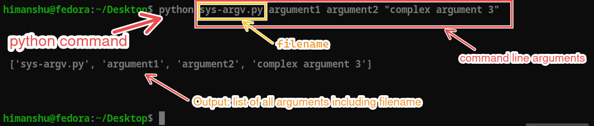

INTRO FOR MAD_1 in this course you will learn

# Basic setup guide

Hello students. In this module, we will guide you through the basic setup and use of the tools required for this course. Also:
- What is latency and bandwidht
- accessing command-line input using the `sys` module


::: tip **Note:**
 We strongly encourage you to practice the course content on a laptop and not rely on a smartphone.
:::

## 1. Python

In this course, we will use the Python programming language for application development. Python is a high-level, interpreted programming language known for its simplicity and readability.

### Why Python

* Easy to learn and use.
* Extensive libraries and frameworks.
* Cross-platform compatibility.
* Strong community support.
* Versatile and can be used for web development, data analysis, artificial intelligence, scientific computing, automation, and more.

### Installation of Python

1. Open a browser and visit the official Python downloads page: [python download page](https://www.python.org/downloads/).
1. Download and install the version for your operating system.
1. During installation, make sure to check the box that says **Add Python to PATH**.
1. After installation, open Command Prompt and type `python --version` to verify the installation.
1. You should see the installed Python version printed in the terminal.
1. If you see an error message, revisit the installation steps and ensure that Python is added to PATH.<br> Video guide: [python installation video](https://www.youtube.com/watch?v=91SGaK7_eeY).


### Virtual Environments

Virtual environments are isolated environments that allow you to manage dependencies for different projects separately. This helps to avoid conflicts between packages required by different projects.

#### Creating a virtual environment

To create a virtual environment, open Command Prompt (or a terminal) and navigate to your project directory. Then run the following command:

```bash
python -m venv env_name
```

Replace `env_name` with the desired name for your virtual environment.

#### Activating a virtual environment

::: code-group
```bash [On Windows]
# enter following command in command prompt
.\env_name\Scripts\activate
```

```bash [On macOS and Linux]
# enter following command in terminal
source env_name/bin/activate
  ```
  
:::

#### Deactivating a virtual environment

To deactivate the virtual environment, simply run the following command:

```bash
deactivate
```

If you followed the steps correctly, you should see the virtual environment name in the Command Prompt/terminal, indicating that the virtual environment is active. <br>
Video guide: [python virtual environment video](https://youtu.be/Z9Vm9Uxk5pA).
<!-- <div style="position:relative;padding-bottom:56.25%;height:0;overflow:hidden;">
  <iframe
    src="https://www.youtube.com/embed/Z9Vm9Uxk5pA"
    style="position:absolute;top:0;left:0;width:100%;height:100%;border:0;"
    allowfullscreen
    allow="accelerometer; autoplay; clipboard-write; encrypted-media; gyroscope; picture-in-picture; web-share">
  </iframe>
</div> -->


### pip - Python package installer

### pip installation

`pip` is the package installer for Python. It is included by default with Python version 3.4 and above. To verify that `pip` is installed, open Command Prompt (or a terminal) and run `pip --version`.

#### Basic pip commands

* To install a package: `pip install package_name`
* To uninstall a package: `pip uninstall package_name`
* To list installed packages: `pip freeze`
* To upgrade a package: `pip install --upgrade package_name`
* To install packages from a requirements file: `pip install -r requirements.txt`
* To uninstall packages from a requirements file: `pip uninstall -r requirements.txt`
* To show information about a package: `pip show package_name`

For example, to install the Flask package, run:

```bash
pip install flask
```

**Note:** Make sure to activate your virtual environment before installing packages to ensure they are installed in the correct environment.

## 2. Code Editor

Although there are many code editors available, the one we will use throughout this course is *Microsoft Visual Studio Code* (**VS Code**).

### Why VS Code

* Free and open source.
* Lightweight and fast.
* Cross-platform (available on Windows, macOS, and Linux).
* A large number of extensions for various programming languages and frameworks.
* Integrated terminal.
* Git integration.
* Debugging support.

### Installation of VS Code

The installation steps for VS Code differ by operating system. Below are the steps for **Windows 10/11**:

1. Open a browser and visit the official VS Code downloads page: [vscode download page](https://code.visualstudio.com/download).
1. Download and install the version for your operating system.
1. During installation, make sure to check the box that says **Add to PATH**.
1. After installation, open Command Prompt and type `code --version` to verify the installation.
1. You should see the installed VS Code version printed in the terminal.
1. If you see an error message, revisit the installation steps and ensure that VS Code is added to PATH.<br> Video guide: [vscode installation video](https://www.youtube.com/watch?v=wU7IQLIOwoo).
<!-- <iframe
  width="100%"
  height="400"
  src="https://www.youtube.com/embed/wU7IQLIOwoo"
  title="YouTube video player"
  frameborder="0"
  allow="accelerometer; autoplay; clipboard-write; encrypted-media; gyroscope; picture-in-picture; web-share"
  allowfullscreen>
</iframe> -->

### Basic usage of VS Code

1. Open VS Code.
1. Open a folder or create a new file to start coding.
1. Use the integrated terminal by going to `View` > `Terminal` or pressing ``Ctrl + ` ``.
1. Install extensions by going to the Extensions view by clicking on the Extensions icon in the Activity Bar on the side of the window or pressing `Ctrl + Shift + X`.

***VS Code tour video guide:*** [vscode tour video](https://youtu.be/yjeHLSrhPao).


| Prefix | Power of 10 |
| ------ | ----------- |
| exa    | $10^{18}$   |
| peta   | $10^{15}$   |
| tera   | $10^{12}$   |
| giga   | $10^{9}$    |
| mega   | $10^{6}$    |
| kilo   | $10^{3}$    |
| hecto  | $10^{2}$    |
| deka   | $10^{1}$    |
| byte   | $10^{0}$    |

- 📦 Bits and Bytes

    - **1 Byte** = 8 bits
    - **1 KB** = 1000 Bytes
    - **1 MB** = 1000 KB = $10^{6}$ Bytes
    - **1 GB** = 1000 MB = $10^{6}$ KB = $10^{9}$ Bytes
    - **1 TB** = 1000 GB = $10^{6}$ MB = $10^{9}$ KB = $10^{12}$ Bytes

- ⏱️ Time Conversions
    - **1 second (s)** = 1000 milliseconds (ms)
    - **1 millisecond (ms)** = $10^{-3}$ seconds
    - **1 microsecond (µs)** = $10^{-3}$  milliseconds = $10^{-6}$  seconds
    - **1 nanosecond (ns)** = $10^{-3}$  microseconds = $10^{-6}$  milliseconds = $10^{-9}$  seconds

- 🔢 Large Number Units
    - **1 million** = $10^{6}$  units
    - **1 billion** = $10^{3}$  million = $10^{9}$  units
    - **1 trillion** = $10^{3}$  billion = $10^{6}$  million = $10^{12}$  units

    
# Latency (Time delay)
Latency = How long it takes for data to travel from client → server → client

Speed of light in vacuum $\approx 3 \times 10^8 \text{ m/s}$
In copper/fiber cables $\approx 2 \times 10^8 \text{ m/s}$
Rule of thumb:
  - ≈ 5 nanoseconds per meter
  - ≈ 5 milliseconds per 1000 km

- If continuous request-response: new request is sent only after receiving the response

::: danger ❓Problem 1: A student in Chennai orders clothes from a online shop which hosts a server in Delhi.
  - Distance between client and server = 2000 km
  - Signal speed $= 2 \times 10^8 \text{ m/s}$
:::

::: details Calculate the one-way delay (in ms)
$$\begin{gather} \text{ Time } = \frac{\text{Distance}}{\text{Speed}} \\ \frac{2000 \times 10^3}{2 \times 10^8} \\ = 1 \times 10^{-2} = 10\text{ milliseconds}\end{gather}$$
:::

::: details Calculate the round-trip delay (in ms)
$2 \times \text{10 ms = 20 ms}$ as student goes to delhi and delhi back to student
:::

::: details What is the maximum number of requests per second the client can make?
$$\begin{gather} \text{Requests per second} \approx \frac{1}{\text{Round-trip latency}} \\ = \frac{1}{\text{20 ms}} = \frac{1}{0.02} =
\text{50 requests/sec} \end{gather}$$
👉 Latency limits how many requests you can do per second, even if student has high bandwidth
:::
<LatencyVisualizer />

## 🌐 Bandwidth
$$
\text{Bandwidth} = (\text{Number of requests per second }) \times (\text{size of request})
$$

:::danger ❓Problem 2: A **course-selling portal** allows students to search for courses:
- HTML + CSS + JS = 18 KB
- HTTP headers = 200 B
- Total response size ≈ 18.2 KB

During peak time:
- 1,000 students are searching
- Each user makes 2 searches per second
:::

:::details How many requests per second does the server receive?
$$
1000 \times 2 = 2000 \text{ requests/sec}
$$
:::


::: details How much data (in MB per second) does the server send?
$$\begin{gather}
2000 \times 18.2 \text{ KB} = 36{,}400 \text{ KB/s} \\=  36.4 \text{ MB/s}
\end{gather}
$$
:::

::: detials What is the minimum bandwidth (in Mbps) required?
$$
36.4 \times 8 = 291.2 \text{ Mbps}
$$

👉 At least **300 Mbps bandwidth** is needed to avoid congestion.
:::

::: danger 3.❓ Gamer streams a **live event** using own streaming server.
- Number of viewers = 50,000
- Each viewer needs a a **4 MB buffer** on the server (few seconds of video)


::: details How much total memory (in GB) is required?
$$\begin{gather}
50{,}000 \times 4 \text{ MB} = 200{,}000 \text{ MB}
\\ = 200 \text{ GB}
\end{gather}
$$

:::

:::details Why is it impractical to handle this using a single server?
- RAM requirement is very high
- Network bandwidth can restrict you.
- One server failure stops the game stream⁉️

👉 Real systems use **CDNs, edge servers, and load balancing**
:::

::: info Explain why:
Increasing bandwidth does not always reduce page loading time.
:::


| Concept       | Meaning                              |
| ------------- | ------------------------------------ |
| **Latency**   | How fast data travels (time delay)   |
| **Bandwidth** | How much data can be sent per second |

For more numericals
<iframe src="https://drive.google.com/file/d/1WzbE5AQ08NXfRE6adb7sggVSy6yndeY2/preview" width="640" height="480"></iframe>

## Sys Module

The `sys` module in Python provides access to some variables used or maintained by the interpreter and to functions that interact strongly with the interpreter. We will only cover a few important aspects of the `sys` module here.

- `sys.argv`: A list of command-line arguments passed to a Python file. The first element is the file name.
- `sys.exit([arg])`: Exit from Python. This function can take an optional argument to specify the exit status.
- `sys.version`: A string containing the version of the Python interpreter.
- `sys.platform`: A string that identifies the platform on which Python is running.

### sys.argv

The `sys.argv` list contains the command-line arguments passed to the file. The first element, `sys.argv[0]`, is the name of the file itself. The subsequent elements are the arguments passed to the file.

Here is an example of how to use `sys.argv` to print the file name and its arguments:

```python
import sys
print("file name:", sys.argv[0])
```

If you run the file with arguments like this:

```bash
python myfile.py arg1 arg2
```

The output will be:

```txt
file name: myfile.py
```

We can also print the entire `sys.argv` list:

```python
import sys
print(sys.argv)
```

If you run the file with arguments like this:

```bash
python myfile.py argument1 argument2 "complex argument 3"
```

The output will be:

```txt
['myfile.py', 'argument1', 'argument2', 'complex argument 3']
```

See the image below for a visual representation of `sys.argv` for the above command:



:::info

- The first element of `sys.argv` is always the file name.
- If no arguments are passed, `sys.argv` will contain only one element, the file name.
- Arguments are space-separated strings but we can enclose them in quotes to include spaces in arguments or name of the file.

:::