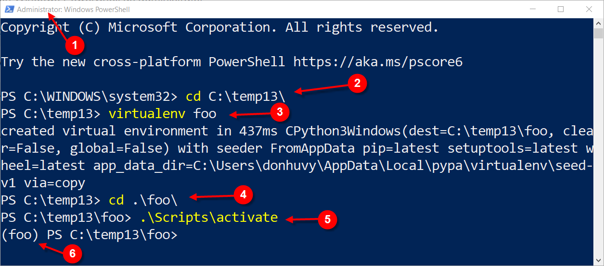

# Basic setup guide

Hello students. In this module, we will guide you through the basic setup and use of the tools required for this course.

::: tip **Note:**
 We strongly encourage you to practice the course content on a laptop and not rely on a smartphone.
:::

## 1. Python

In this course, we will use the Python programming language for application development. Python is a high-level, interpreted programming language known for its simplicity and readability.

### Why Python

* Easy to learn and use.
* Extensive libraries and frameworks.
* Cross-platform compatibility.
* Strong community support.
* Versatile and can be used for web development, data analysis, artificial intelligence, scientific computing, automation, and more.

### Installation of Python

1. Open a browser and visit the official Python downloads page: [python download page](https://www.python.org/downloads/).
1. Download and install the version for your operating system.
1. During installation, make sure to check the box that says **Add Python to PATH**.
1. After installation, open Command Prompt and type `python --version` to verify the installation.
1. You should see the installed Python version printed in the terminal.
1. If you see an error message, revisit the installation steps and ensure that Python is added to PATH.<br> Video guide: [python installation video](https://www.youtube.com/watch?v=91SGaK7_eeY).


### Virtual Environments

Virtual environments are isolated environments that allow you to manage dependencies for different projects separately. This helps to avoid conflicts between packages required by different projects.

#### Creating a virtual environment

To create a virtual environment, open Command Prompt (or a terminal) and navigate to your project directory. Then run the following command:

```bash
python -m venv env_name
```

Replace `env_name` with the desired name for your virtual environment.

#### Activating a virtual environment

[list2tab]

* On Windows
    Enter the following command in command prompt:
    ```bash
    .\env_name\Scripts\activate
    ```

- On macOS and Linux
    Enter the following command in terminal:
    ```bash
    source env_name/bin/activate
    ```

#### Deactivating a virtual environment

To deactivate the virtual environment, simply run the following command:

```bash
deactivate
```

If you followed the steps correctly, you should see the virtual environment name in the Command Prompt/terminal, indicating that the virtual environment is active. <br>
Video guide: [python virtual environment video](https://youtu.be/Z9Vm9Uxk5pA).
<!-- <div style="position:relative;padding-bottom:56.25%;height:0;overflow:hidden;">
  <iframe
    src="https://www.youtube.com/embed/Z9Vm9Uxk5pA"
    style="position:absolute;top:0;left:0;width:100%;height:100%;border:0;"
    allowfullscreen
    allow="accelerometer; autoplay; clipboard-write; encrypted-media; gyroscope; picture-in-picture; web-share">
  </iframe>
</div> -->




### pip - Python package installer

### pip installation

`pip` is the package installer for Python. It is included by default with Python version 3.4 and above. To verify that `pip` is installed, open Command Prompt (or a terminal) and run `pip --version`.

#### Basic pip commands

* To install a package: `pip install package_name`
* To uninstall a package: `pip uninstall package_name`
* To list installed packages: `pip freeze`
* To upgrade a package: `pip install --upgrade package_name`
* To install packages from a requirements file: `pip install -r requirements.txt`
* To uninstall packages from a requirements file: `pip uninstall -r requirements.txt`
* To show information about a package: `pip show package_name`

For example, to install the Flask package, run:

```bash
pip install flask
```

**Note:** Make sure to activate your virtual environment before installing packages to ensure they are installed in the correct environment.

## 2. Code Editor

Although there are many code editors available, the one we will use throughout this course is *Microsoft Visual Studio Code* (**VS Code**).

### Why VS Code

* Free and open source.
* Lightweight and fast.
* Cross-platform (available on Windows, macOS, and Linux).
* A large number of extensions for various programming languages and frameworks.
* Integrated terminal.
* Git integration.
* Debugging support.

### Installation of VS Code

The installation steps for VS Code differ by operating system. Below are the steps for **Windows 10/11**:

1. Open a browser and visit the official VS Code downloads page: [vscode download page](https://code.visualstudio.com/download).
1. Download and install the version for your operating system.
1. During installation, make sure to check the box that says **Add to PATH**.
1. After installation, open Command Prompt and type `code --version` to verify the installation.
1. You should see the installed VS Code version printed in the terminal.
1. If you see an error message, revisit the installation steps and ensure that VS Code is added to PATH.<br> Video guide: [vscode installation video](https://www.youtube.com/watch?v=wU7IQLIOwoo).
<!-- <iframe
  width="100%"
  height="400"
  src="https://www.youtube.com/embed/wU7IQLIOwoo"
  title="YouTube video player"
  frameborder="0"
  allow="accelerometer; autoplay; clipboard-write; encrypted-media; gyroscope; picture-in-picture; web-share"
  allowfullscreen>
</iframe> -->

### Basic usage of VS Code

1. Open VS Code.
1. Open a folder or create a new file to start coding.
1. Use the integrated terminal by going to `View` > `Terminal` or pressing ``Ctrl + ` ``.
1. Install extensions by going to the Extensions view by clicking on the Extensions icon in the Activity Bar on the side of the window or pressing `Ctrl + Shift + X`.

***VS Code tour video guide:*** [vscode tour video](https://youtu.be/yjeHLSrhPao).

