---
tags:
  - T3-2025
  - MAD1
  - W1
date: 2025-09-25 18:22
Lecture slides: https://drive.google.com/file/d/1tF4xXmpifRsXBd1YA4Ww5w3xDrvEMfNt/view?usp=sharing
---

<div style="background-color=black;color:white">
</div>

::: info App
is computer software, or a program, most commonly a small, specific one used for mobile devices. The term app originally referred to any mobile or desktop application, but as more app stores have emerged to sell mobile apps to smartphone and tablet users, the term has evolved to refer to small programs that can be downloaded and installed all at once.
:::

## Platform: Web-based
| Desktop                                                   | Mobile Apps                                | Web Apps                                         |
| --------------------------------------------------------- | ------------------------------------------ | ------------------------------------------------ |
| standalone                                                | network oriented                           | heavily *Network cloud* Platform                 |
| local data storage + Network                              | limited screen space, memory/process/power | workarounds for offline processing, *datacenter* |
| **Software Dev Kits(SDK)** OS specific, Custom frameworks | OS specific, cross platform                | across OS, multi-device, common base             |
| Keyboard Mouse, folder, files, docs                       | touchscreen tilt audio camera              | Dynamic Web 2.0                                  |

**Embedded:** single function, limited scope


::: warning SDK
- Libraries/APIs → Pre-written code you can reuse instead of reinventing the wheel.
- Compiler/build tools → To turn your source code into runnable programs.
- Debuggers → To find and fix errors.
- Documentation + Examples → To guide you on how to use the tools.
- Sometimes even an emulator/simulator (like Android SDK has a phone emulator).
:::

## [Architecture: Client ↔ Server](https://em360tech.com/sites/default/files/inline-images/em360tech_client-server-architecture_enterprise-architecture-models.jpg)


- **Machine Client**: Software/antivirus updaters ❌ user interact
- **Local Systems**: both on same machine
*Ex: Databases, Messaging, Browsing*
- Multiple Server, single/multiple queue, load balancing frontends
- Each request is independent — the server doesn’t remember earlier interactions (unless extra mechanisms like *sessions, cookies, or tokens* are used).
## Distributed peer-to-peer

Data can flow in both ways. 
- All peers are considered "**equivalent**"
- **Error Tolerance**
	- Masters/introducers (❌ controller/central)
	- Election/ re-selection of masters on failure of server (a dedicated computer always connected to the Internet, sole purpose is to deliver content)
- Shared ℹ️info
Ex: *bittorrent, Blockchain, Distributed file systems (encrypted so only allowed to access file) IPFS, Tahoe*

::: danger Design Pattern
A general, reusable solution to a commonly occurring problem within a given context in software design. 
- Designers observe patterns → guide & reuse for faster development
- <span style="color:rgb(240, 96, 118)"> Indexed Metadata </span>: when? /w attachments? summarize basic information for tracking
:::

<a href="4 Model-View-Controller">Software Architecture: Model-View-Controller</a>

#### Transmission Control Protocol
65,535 ($2^{16 \text{ bits}}-1$) TCP uses 16-bit unsigned integers for port numbers, allowing values from 0 to 65,535. Port 0 is reserved, so usable ports range from 1 to 65,535.

```mermaid
flowchart LR
    %% --- TOP BLOCK: Networking History & Protocols ---
    1890["**Telephone**: Physical wires tied up for duration. A talks to B through *complex switching network*"]
    1960["**Packet-switched networks**: Wires occupied only when data to be sent; can carry several diff convos, ↓wires ↑speed, any type of data"]
    proto["*IBM SNA, Digital DECnet, Xerox Ethernet* with own **Protocol**: How to format packets, place them on wire, headers/checksums"]
    net83["How Communicate with diff network protocols? -> 1 **Internet**<br>New standard headers, packet types, *network of servers* carried over Ethernet, DECnet, PPP, SLIP"]

    1890 --> 1960 --"**ARPANet**<br>node-to-node"--> proto --> net83
    S["**Server expects requests**<br>Nature of request & client<br>Type of results client can deal with"]
    C["**Client expects response**<br>Ask server for something<br>What you can accept<br>Read result & process"]
     C --> resp["**Resp Header**: Convey acceptable resp types, languages, encoding, cache info, status codes<br>**HyperText**: Formatting hints in text doc to 'link' to other doc"] --> S
```

```mermaid
flowchart LR
http["**HyperText Transfer Protocol**: Primarily text<br>**GET**: simple requests, search queries<br>**POST**: complex forms, large text, files<br>**PUT/DELETE**: basis of most APIs - REST, CRUD"]
tcp["**TCP**:track of the sequence of packets being sent<br>Reliable ❌acknowledge error→ retry from orgin server, autoscale ↑speed until fails so backoff (**adjust network limit**)"] 
    IP["**IP DHCP** ascertains a unique **IPv4 address** to every device in the world when it boots for lease time❌remember 4 num (0-255  sep by dots) 32 bit(4B so IPv6 128 bits) -> 4 octets & change /w machine"]
    1985["easy to remember url: protocol://www.**Domain Name**.com/gov/org/net/country/folder/file.html<br>**World Wide Web**: *network of docs*"]
    ports["TCP distinguish web services<br> **80**: browse HTTP webpages<br> **443**: HTTPSecure<br>**25**: sending emails SMTP<br>**53**: DNS"]

    tcp --> ports --> http --> IP <--"DNS database of ISP local cache/other DNS servers"--> web 
```



:::details **Web server**: 
 - Listen for incoming network connections on a **fixed port**
 - Respond in specific ways
 - Opening network connections, ports etc already known to OS
:::

:::details **Protocol**:
- What should client ask server
-  How should server respond to client
:::

#### Status codes

| Category | Status Code | Status Name | Description |
| --- | --- | --- | --- |
| <span style="font-weight:bold; color:rgb(181, 118, 244)"> 1xx Informational </span>  | 100 | Continue | Request is in Progress |
| <span style="font-weight:bold; color:rgb(181, 118, 244)">2xx Success </span>  | 200 OK |  Request was fulfilled | GET, PUT success |
|  | 201 Created | Resource created | POST success |
|  | 204 No Content | No data in response |
| <span style="font-weight:bold; color:rgb(181, 118, 244)">3xx Redirection </span>  | 301 | Moved Permanently |  |
|  | 302 Found | Moved Temporarily |  |
| <span style="font-weight:bold; color:rgb(181, 118, 244)">4xx Client Error </span>  | 400 Bad Request | Invalid input | Missing fields or format |
|  | 401 Unauthorized | Not logged in | Token missing |
|  | 403 Forbidden | Server refuses to authorize request, even if client is authenticated | Student accessing admin |
|  | 404 Not Found | Resource missing | Course ID not found |
|  | 415 Unsupported Media Type | Wrong Content-Type | Not JSON |
| <span style="font-weight:bold; color:rgb(181, 118, 244)">5xx Server Error </span>  | 500 | Internal Server Error | A general error indicating something went wrong on the server |
|  | 502 Bad Gateway | Invalid response from a gateway or proxy | Bug in backend |
|  | 503 Service Unavailable | Overloaded or down | Server down |
|  | 504 | Gateway Timeout |  |

<script setup>
import LatencyVisualizer from '../.vitepress/components/LatencyVisualizer.vue'
import StatusCodeSimulator from '../.vitepress/components/StatusCodeSimulator.vue'
//import CurlRequestSimulator from '../.vitepress/components/CurlRequestSimulator.vue'
</script>
<StatusCodeSimulator />
| Web 1.0 1990-2000 | Web 2.0 2004-2016 | Web 3 2016- |
| ------- | ------- | ----- |


- Listen on a fixed port
- On incoming request, run some code & return a result
	- Standard headers

### full HTTP request(📤includes all headers):`curl -v http://localhost:1500`
| `-v or --verbose` | detailed ℹ️info about the request & response, including headers.               |
| ----------------- | ------------------------------------------------------------------------------ |
| `-i or --include` | include HTTP response headers                                                  |
| `-x or --proxy`   | specify a proxy server `"http://proxy.example.com:8080` to use for the request |
| `-H or --header`  | add custom `"Header-Name: Header-Value"` to your HTTP request even multiple    |
 
- HTTP is a **stateless protocol**: each client request is handled independently, the server forgets everything about a client between requests. If need to maintain a user's state across multiple requests (shopping cart) →  *HTTP cookies/hidden form fields*

```
 while true; do 
 	echo -e "HTTP/1/1 200 OK\n\n $(date)" |
 		nc -l localhost 1500;
 done
```
 `python -m http.server`
 $http:// \underbrace{0.0.0.0}_\text{IP address}: \underbrace{8000}_\text{default port}/$serves files from local folder
HTTP 1.2 variant → allows pipelined connection, continuous large<br>
 `>` indicate request headers sent by the client (cURL)<br>
 `<` received from the server.<br>
 `*` indicate additional ℹ️like SSL/TLS handshake details and connection info.

 ##### connect url
```
 GET / HTTP/1.1
 Host: localhost:8000 or www.domain.com
 User-Agent: curl/7.64.1
 Accept: */*
 <Server: SimpleHTTP1.0/0.6 Python/ver Date: 
 <Content-type: text/html
 <Content-length: 8+(typed chars in index.html)
```
The IP address `127.0. 0.1 /::1` is called a loopback address. Packets sent to this address never reach the network but are looped through the network interface card only. This can be used for diagnostic purposes to verify that the internal path through the TCP/IP protocols is working.


#### Latency
Speed of light: 3,00,000 m/s ~ $2 \times 10^{8}$ m/s on **copper** cable ~5ns/m  ~ 5ms for 1000km
- If continuous request-response : <span style="color:rgb(240, 96, 118)"> 50 requests/sec </span> (CHN to DEL 2000km 20ms round trip)
#### Response size

$$\boxed{\begin{aligned}&\text{ 19245 bytes of content(trackers, 100B headers, HTML, CSS, JS)} \\& \text{receives 14–16.4B daily →each person searching 3-4x}\\& 189,815  \text{ requests/second} \sim \frac{3.652  \times 10^9}{19.245 \times 10^3}\\&\text{Network connection=3.6 Gbps otherwise server crashes}\end{aligned}}$$
$$\boxed{\begin{aligned}\text{Youtube$\underbrace{2M}_\text{live views} \times\underbrace{6MB}_\text{py HTTP server process}$=12 TB RAM}\end{aligned}}$$
$$\boxed{\begin{aligned}&\text{Google index 100B web pages $\sim$ 100 PetaBytes}\\&\text{Cross-reference, pagerank distributed over Million Servers }\end{aligned}}$$

<LatencyVisualizer />

`curl.exe -v  -w "Downloaded bytes: %{size_download}\n" https://www.google.com`
| Prefix | Power of 10 |
| ------ | ----------- |
| exa    | $10^{18}$   |
| peta   | $10^{15}$   |
| tera   | $10^{12}$   |
| giga   | $10^{9}$    |
| mega   | $10^{6}$    |
| kilo   | $10^{3}$    |
| hecto  | $10^{2}$    |
| deka   | $10^{1}$    |
| byte   | $10^{0}$    |


:::warning TCP, UDP, Proxy, Peer-to-Peer, Broadcast, Unicast, Multicast
- **TCP (Transmission Control Protocol)** is a connection-oriented protocol that ensures reliable, ordered, and error-checked delivery of data between devices on a network through handshakes and acknowledgements.
- **UDP (User Datagram Protocol)** is a connectionless protocol that sends data without establishing a prior connection, prioritizing speed over reliability and not guaranteeing delivery.
- **Proxy** acts as an intermediary server between clients and other servers to facilitate requests, improving security, performance, or anonymity.
- **Peer-to-Peer (P2P)** is a decentralized communication model where each device can act as both client and server, sharing resources directly without central servers.
- **Broadcast** is a one-to-all communication where data is sent from one sender to all devices on a network segment simultaneously.
- **Unicast** is a one-to-one communication where data is sent from one sender to a single specific receiver.
- **Multicast** is a one-to-many communication where data is sent from one sender to multiple specified receivers who join a multicast group, optimizing bandwidth usage.
::: 