# Historical Background of Networks

```mermaid
flowchart LR
    %% --- TOP BLOCK: Networking History & Protocols ---
    A["📞 **Telephone** Networks <br> Physical line tied up during call. A talks to B through *complex switching network*"]
    B["📦 **Packet-switched networks**: Wire occupied only when data is sent; can carry several different convos, any type of data. faster"]
    proto["Many protocols: *IBM SNA, DECnet, Ethernet* each had own rules: How to format packets, place them on wire, headers/checksums"]
    C["How do different networks talk❓→ 🌍 **Internet**<br>standard headers & packet format *network of servers*"]

    A --> B --"**ARPANet**<br>Node-to-node network"--> proto  --> C

```

```mermaid
flowchart LR
tcp["🔁**TCP**: Reliable delivery"] 
domain["🌐 Domain names are easier to remember than IP address: protocol://www.**Domain Name**.com/gov/org/net/country/folder/file.html"]
http["📄 HyperText: Text with links & Formatting tags"]
web["🌍**World Wide Web**: network of linked documents"]
tcp --> domain --> http --"DNS database of ISP local cache/other DNS servers"--> web 
```

## HyperText Transfer Protocol (HTTP)
- Rulebook for communication between browser and server
- **Client requests server** for some data -> read result -> process
- **Server sends response** with Headers + Body
- **Response Header**: contains
  - acceptable content types client can deal with
  - language
  - encoding
  - cache info
  - status codes

| Method     | Meaning      | Simple Example |
| ---------- | ------------ | -------------- |
| **GET**    | Ask for data | Open a webpage, search queries |
| **POST**   | Send data    | Submit a form, upload files  |
| **PUT**    | Update data  | Edit user profile   |
| **DELETE** | Remove data  | Delete account |

## Transmission Control Protocol
TCP uses 16-bit unsigned integers for port numbers
- This allows values from 0 to 65,535 ($2^{16 \text{ bits}}-1$). 

#### Ports
::: info Port 0 is reserved
If you try to bind with port 0, Operating System automatically assigns a random free port.
:::

#### IP Address
- Unique number to every device on a network
- IPv4: `192.168.1.1` 
  - 4 numbers 
  - in range 0–255, separated by dots
  - Size: `32` bits = 4 Bytes
- Assigned temporarily using DHCP when your device boots
- IPv6
- Size: `128` bits
- Created due to IPv4 address shortage

👉 IP = which machine?
👉 Port = which service on that machine? 
| Port    | Service            |
| ------- | ------------------ |
| **80**  | HTTP webpages         |
| **443** | HTTPSecure |
| **25**  | sending Email      |

:::details **Web server**: 
 - Listen for incoming requests on a **fixed port**→ Respond
 - OS manages ports and network connections
:::

:::details **Protocol** defines: 
- What should client can ask server?
- How the server respond to client?
:::

### Status codes

| Category | Status Code | Status Name | Description |
| --- | --- | --- | --- |
|  1xx Informational   | 100 | Continue | Request is in Progress |
| 2xx Success   | 200 OK |  Request was fulfilled | GET, PUT success |
|  | 201 Created | Resource created | POST success |
|  | 204 No Content | No data in response |
| 3xx Redirection   | 301 | Moved Permanently |  |
|  | 302 Found | Moved Temporarily |  |
| 4xx Client Error   | 400 Bad Request | Invalid input | Missing fields or format |
|  | 401 Unauthorized | Not logged in | Token missing |
|  | 403 Forbidden | Server refuses to authorize request, even if client is authenticated | Student accessing admin |
|  | 404 Not Found | Resource missing | Course ID not found |
|  | 415 Unsupported Media Type | Wrong Content-Type | Not JSON |
| 5xx Server Error   | 500 | Internal Server Error | A general error indicating something went wrong on the server |
|  | 502 Bad Gateway | Invalid response from a gateway or proxy | Bug in backend |
|  | 503 Service Unavailable | Overloaded or down | Server down |
|  | 504 | Gateway Timeout |  |

<!-- <ClientOnly> -->
  <StatusCodeSimulator />
<!-- </ClientOnly> -->

| Web 1.0 1990-2000 | Web 2.0 2004-2016 | Web 3 2016- |
| ------- | ------- | ----- |

::: details TCP, UDP, Proxy, Peer-to-Peer, Broadcast, Unicast, Multicast
- **TCP (Transmission Control Protocol)** is a connection-oriented protocol that ensures reliable, ordered, and error-checked delivery of data between devices on a network through handshakes and acknowledgements.
- **UDP (User Datagram Protocol)** is a connectionless protocol that sends data without establishing a prior connection, prioritizing speed over reliability and not guaranteeing delivery.
- **Proxy** acts as an intermediary server between clients and other servers to facilitate requests, improving security, performance, or anonymity.
- **Peer-to-Peer (P2P)** is a decentralized communication model where each device can act as both client and server, sharing resources directly without central servers.
- **Broadcast** is a one-to-all communication where data is sent from one sender to all devices on a network segment simultaneously.
- **Unicast** is a one-to-one communication where data is sent from one sender to a single specific receiver.
- **Multicast** is a one-to-many communication where data is sent from one sender to multiple specified receivers who join a multicast group, optimizing bandwidth usage.
::: 
