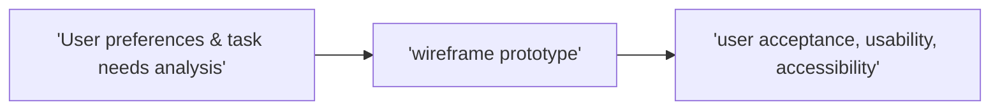

---
tags:
  - MAD1
  - W3
date: 2025-04-24 14:25
syllabus: 
---

- ✅✅ [Builtin-filter](https://jinja.palletsprojects.com/en/stable/templates/#list-of-builtin-filters)


client-side lang: javascript

| use                 | JavaScript code             | Python code                     |
| ------------------- | --------------------------- | ------------------------------- |
| initialise variable | `let counter = 0;`          | `counter = 0`                   |
| for loop            | `for (let i=0; i<3; i++){}`for (define variable;condition;incrementing condition){ Do something;}  | `for i in range(3):`indentation |
| function definition | `function foo() {}`         | `def foo():`                    |
| print/output        | `console.log("Hello")`      | `print("Hello")`                |
| if statement        | `if (x > 0) {}`             | `if x > 0:`                     |
| else if/elif        | `else if (x < 0) {}`        | `elif x < 0:`                   |
| else                | `else {}`                   | `else:`                         |
| list/array          | `let arr =;`                | `arr =`                         |
| dictionary/object   | `let obj = {a: 1, b: 2};`   | `obj = {'a': 1, 'b': 2}`        |
| null/none           | `null`                      | `None`                          |
| fstring             | ``${input.value}``          | `f"{}"`                         |

`let`: Block-scoped, reassignable.
`const`: Block-scoped, not reassignable (constant).
`var`: Function-scoped, outdated (avoid using).
== → checks for value(what is assigned)
=== → checks for both type(int/bool/string) and value

**Logical: && (AND), || (OR), ! (NOT)**

1. **blur**Triggered when an element loses focus, e.g., `<input onblur="alert('Lost focus')">`
2. **change**Fires when the value of an input, textarea, or select changes & loses focus, e.g., `<input onchange="alert('Changed')">`
3. **click**Occurs when an element is clicked, e.g., `<button onclick="alert('Clicked!')">Click me</button>`
4. **drag**Fires repeatedly while an element is being dragged, e.g., `element.addEventListener('drag', function(){ /* ... */ })`
5. **focus**Triggered when an element gains focus, e.g., `<input onfocus="alert('Focused!')">`
6. **keyup**Fires when a key is released, e.g., `<input onkeyup="alert('Key released!')">`.
7. **load**Occurs when a page or resource finishes loading, e.g., `window.onload = function(){ alert('Loaded!') }`.
8. **mousedown**Fires when a mouse button is pressed down over an element, e.g., `<div>`
9. **mouseover**Occurs when the mouse pointer enters an element, e.g., `<div>`
10. **mouseup**Fires when a mouse button is released over an element, e.g., `<div>`
11. **submit**Triggered when a form is submitted, e.g., `<form onsubmit="alert('Form submitted!')">`.
12. **touchmove**Fires when a finger moves across the touch surface, e.g., `element.addEventListener('touchmove', function(){ /* ... */ })`.
13. **unload**Occurs when the document or a resource is about to be unloaded, e.g., `window.onunload = function(){ alert('Unloading!') }`
[JavaScript codes](file:///C:\Users\yashv\Documents\VSCode\MAD1\CS50\JavaScript)
	
- **Model:** Application obj
- **View**: any screen **representation** useful to another entitiy (HTML/JSON/XML/img)
	- User interaction: keyboard, mouse, voice, custom buttons (devices, hardware constraint, user agent contextual info may ❌ be in designer control)
	- User interface: screen, audio, vibration, motor
	- Static: google.com, Partly dynamic: Wikipedia, Mostly dynamic: Amazon,
- **Controller**: How user *interface* reacts to user *input
- Prototyping - wireframes, mockups


### [Usability Heuristics ](https://www.nngroup.com/articles/ten-usability-heuristics/)

[list2card]

- **Visibility of System Status:** Always keep users informed about what is happening through timely & clear feedback.
- **Match Between System & the Real World:** Use language, concepts, & conventions familiar to users; avoid jargon & follow real-world logic.
- **User Control & Freedom:** Provide easy ways for users to undo or exit unwanted actions, giving them a sense of control.
- **Consistency & Standards:** Follow platform & industry conventions so users don’t have to wonder if different words or actions mean the same thing.
- **Error Prevention:** Design to prevent errors before they occur, rather than just relying on good error messages.
- **Recognition Rather Than Recall:** Minimize memory load by making options, actions, & information visible & easily accessible.
- **Flexibility & Efficiency of Use:** Allow both novices & experts to use the system efficiently, offering shortcuts & customization for frequent users.
- **Aesthetic & Minimalist Design:** Keep interfaces simple & uncluttered, showing only relevant information & elements.
- **Help Users Recognize, Diagnose, & Recover from Errors:** Use plain language in error messages, clearly indicate problems, & suggest solutions.
- **Help & Documentation:** Provide easy-to-search, concise help & documentation focused on user tasks, available when needed.

#### PyHTML
```python
import pyhtml as h
t = h.html(
	h.head(
		h.title('Test Page')
	), 
	h.body(
		h.h1('This is a title'),
		h.div('This is some text'),
		h.div(h.h2('inside title'), h.p('some text in a paragraph.'))
		)
	)
)
print(t.render())

def f_table(ctx):
	return (tr(
	td(cell) for cell in row
	) for row in ctx['table'])
```

#### jinja template
```python
from jinja2 import Template

t = Template('$name is the $job of $company')
s = t.substitute(name='Tim Cook', 
job='CEO', company='Apple Inc.')
print(s)
t = Template('Hello {{ something }}') #{{ variable }}
print(t.render(something='World'))

t = Template('My favorite numbers: {{n}}''')
print(t.render())
```

### Accessibility
[list2card]
- ##### perceivable
	- Non-text/Multimedia control → **<span style="color:rgb(98, 151, 208)">Alt</span> Text/Caption**
	- presented in different ways, ❌ loose meaning ✅ <span style="color:rgb(98, 151, 208)">assistive</span> tech
	- easier to **see & hear** content (<span style="color:rgb(98, 151, 208)">speech</span>-oriented browsers)
- ##### operable
	- All functionality available from <span style="color:rgb(98, 151, 208)">keyboard</span>, easier to use inputs other than ⌨️
	- enough time to read & use content
	- ❌ cause <span style="color:rgb(98, 151, 208)">seizures</span>/physical reactions
	- Help users <span style="color:rgb(98, 151, 208)">navigate</span> & find content.
	
- ##### understandable
	- text <span style="color:rgb(98, 151, 208)">readable understandable</span>
	- Content appear & operate in <span style="color:rgb(98, 151, 208)">predictable</span> ways
	- Help users avoid & ✅ <span style="color:rgb(98, 151, 208)">mistakes</span>
	
- ##### robust
	- Max <span style="color:rgb(98, 151, 208)">compatibility</span> for future user tools.

[Inspect Developer Tools](https://youtu.be/Pf2z_Ue73qE?si=XAul5yx0EI6pAZWH) 
`console.table(array)`

