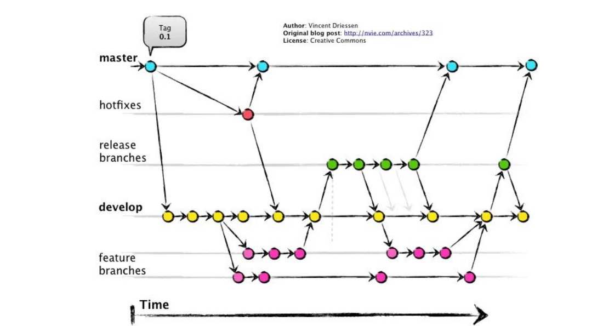

# GIT

Git is a distributed version control system that allows multiple developers to collaborate on a project. It tracks changes to files and enables developers to manage different versions of their codebase. Git was created by Linus Torvalds in 2005 and has since become one of the most popular version control systems in the software development industry.

In this section, we will cover the installation of Git, basic Git commands, and how to use Git for version control in our projects.

## Working of git

Git uses a directed acyclic graph (DAG) to manage the history of commits in a repository. Each commit in Git is represented as a node in the graph, and the edges between nodes represent the parent-child relationships between commits. When we make a commit, Git creates a new node in the graph that points to its parent commit(s). This allows Git to track the history of changes and manage different branches of development.

This information is useful for understanding the further commands and concepts, think of each commit and branch as nodes in a graph.



### Basic Git Workflow

The basic Git workflow(very-simplified) involves the following steps:

```bash
git init
git add <filename>
git commit -m "Commit message"
git push <origin-name> <branch-name>
```

## Installing Git

To install Git on our system, follow the instructions for our operating system:

::: code-group

```md[Windows]
1. Download the Git installer from the official website: https://git-scm.com/download/win
2. Run the installer and follow the prompts to complete the installation.
3. After installation, open the Command Prompt and type `git --version` to verify that Git is installed correctly.
4. Optionally, you can also install Git Bash, which provides a Unix-like terminal for Windows, allowing you to use Git commands more easily.
```

```md[macOS]
1. Open the Terminal and type `git --version`. If Git is not installed, you will be prompted to install it. Follow the prompts to complete the installation.
2. Alternatively, you can install Git using Homebrew by running the command: `brew install git`.
3. After installation, type `git --version` to verify that Git is installed correctly.
```

```md[Linux]
1. Open the Terminal and run the following command to install Git:
   - For Debian-based distributions (e.g., Ubuntu): `sudo apt-get install git`
   - For Red Hat-based distributions (e.g., Fedora): `sudo dnf install git`
2. After installation, type `git --version` to verify that Git is installed correctly.
```

:::

## Classification of Git Commands

Git commands can be classified into several categories based on their functionality:

1. **Configuration Commands**: These commands are used to set up Git and configure user information. Examples include `git config`, `git init`, and `git clone`.
1. **Staging and Committing Commands**: These commands are used to stage changes and commit them to the repository. Examples include `git add`, `git commit`, and `git status`.
1. **Branching and Merging Commands**: These commands are used to manage branches in Git. Examples include `git branch`, `git checkout`, `git merge`, and `git rebase`.
1. **History and Log Commands**: These commands are used to view the history of commits and changes in the repository. Examples include `git log`, `git diff`, and `git blame`.
1. **Stash Commands**: These commands are used to temporarily save changes that are not ready to be committed. Examples include `git stash` and `git stash pop`.
1. **Reverting and Resetting Commands**: These commands are used to undo changes in Git. Examples include `git revert`, `git reset`, `git restore` and `git clean`.
1. **Remote Commands**: These commands are used to interact with remote repositories. Examples include `git remote`, `git push`, `git fetch`, and `git pull`.

Let's explore some of these commands in more detail.

## Configuration Commands

### git init

The `git init` command is used to initialize a new Git repository. It creates a new `.git` directory in the current directory, which will contain all the necessary files and metadata for the Git repository. This command is typically used when starting a new project or when we want to start tracking an existing project with Git. To initialize a Git repository, navigate to the desired directory in the terminal and run the following command:

```bash
git init
```

This will create a new Git repository in the current directory, allowing us to start tracking changes and managing our codebase with Git.

### git config

The `git config` command is used to set up Git and configure user information. It allows us to specify our name and email address, which will be associated with our commits. You can also use this command to configure other settings, such as the default text editor for commit messages.

To set your username and email, use the following commands:

```bash
git config --global user.name "Your Name"
git config --global user.email "your.email@example.com"
```

This will set your username and email globally for all Git repositories on your system. You can also set these values for a specific repository by omitting the `--global` flag and running the commands within the repository directory.

:::info

We can also configure for a specific repository or system-wide settings by using the `--local` or `--system` flags, respectively. The `--local` flag is the default and applies to the current repository, while the `--system` flag applies to all users on the system.

:::

:::info

Setting up the username and email is necessary for committing changes to a Git repository. This information is used to identify the author of each commit and is important for collaboration and tracking changes in a project.

:::

### git clone

The `git clone` command is used to create a copy of an existing Git repository. It allows us to download a repository from a remote server (e.g., GitHub) and create a local copy on our machine. This is typically used when we want to contribute to an existing project or when we want to work on a project that is hosted on a remote repository. To clone a repository, use the following command:

```bash
git clone <repository-url>
```

This command will create a new directory with the name of the repository and download all the files and commit history from the remote repository to our local machine. We can then navigate into the cloned repository and start working on it.

We will cover this command in the next section in more details when we discuss remote repositories and collaboration with Github.

## Adding and Committing Commands

Now that we have initialized a Git repository and configured our user information, we can start adding files and committing changes to our repository.

git follow the following workflow for adding and committing changes:

1. **Make Changes**: First, we make changes to our files in the working directory. This could involve creating new files, modifying existing files, or deleting files.
1. **Stage Changes**: Next, we use the `git add` command to stage the changes we want to include in our next commit. Staging allows us to review and organize our changes before committing them to the repository.
1. **Commit Changes**: Finally, we use the `git commit` command to commit the staged changes to the repository. This creates a new commit with a unique identifier and a message describing the changes made in that commit.

### git add

The `git add` command is used to stage changes in Git. It allows us to specify which files or changes we want to include in the next commit. When we run `git add`, it adds the specified files to the staging area, which is a temporary area where we can review and organize our changes before committing them to the repository. To stage a file, use the following command:

```bash
git add <filename>
```

We can also stage all changes in the current directory by using the following command:

```bash
git add .
```

:::info Empty Directory

Git does not track empty directories. If we want to include an empty directory in our repository, we can create a placeholder file (e.g., `.gitkeep`) inside the directory and stage that file with `git add`.

:::

### git commit

The `git commit` command is used to commit staged changes to the repository. It creates a new commit with a unique identifier and a message describing the changes made in that commit. To commit staged changes, use the following command:

```bash
git commit -m "Your commit message here"
```

The `-m` flag allows us to provide a commit message directly in the command. The commit message should be a brief description of the changes made in that commit, which helps other developers understand the purpose of the commit when they review the commit history.

:::info
It's important to write clear and descriptive commit messages, as they provide context for the changes made in each commit and help other developers understand the history of the project.
:::

### git status

The `git status` command is used to view the current status of our Git repository. It shows us which files have been **modified**, which files are staged for commit, and which files are **untracked** (i.e., not being tracked by Git). To view the status of our repository, use the following command:

```bash
git status
```

This command will provide us with information about the current state of our repository, including any changes that have been made and which files are staged for commit. It is a useful command to run before committing changes to ensure that we are aware of the changes we are about to commit.

## Branching and Merging Commands

Branching is a powerful feature of Git that allows us to create separate branches for different features or bug fixes. This allows us to work on multiple features or fixes simultaneously without affecting the main codebase. Once we have completed our work on a branch, we can merge it back into the main branch (usually called `main` or `master`) to incorporate our changes into the main codebase.

### git branch

The `git branch` command is used to manage branches in Git. It allows us to create new branches, list existing branches, and delete branches. To create a new branch, use the following command:

```bash
git branch <branch-name>
```

To list all existing branches, use the following command:

```bash
git branch
```

To delete a branch, use the following command:

```bash
git branch -d <branch-name>
```

### git checkout

The `git checkout` command is used to switch between branches in Git. It allows us to move from one branch to another and work on different features or fixes without affecting the main codebase. To switch to a different branch, use the following command:

```bash
git checkout <branch-name>
```

This command will switch our working directory to the specified branch, allowing us to work on that branch without affecting the main codebase. We can also use the `git checkout` command to create a new branch and switch to it in one step by using the `-b` flag:

```bash
git checkout -b <new-branch-name>
```

This command will create a new branch with the specified name and switch to that branch immediately.

### git merge

The `git merge` command is used to merge changes from one branch into another branch. It allows us to incorporate changes from a feature branch back into the main branch once we have completed our work on that feature. To merge a branch into the current branch, use the following command:

```bash
git merge <branch-name>
```

This command will merge the specified branch into the current branch, incorporating any changes made in that branch into the current branch. If there are any conflicts between the branches (i.e., changes that cannot be automatically merged), Git will prompt us to resolve those conflicts before completing the merge.

### git rebase

The `git rebase` command is used to reapply commits on top of another base branch. It allows us to maintain a cleaner commit history by moving our commits to a new base branch. To rebase the current branch onto another branch, use the following command:

```bash
git rebase <branch-name>
```

This command will take all the commits from the current branch and reapply them on top of the specified branch. This can help to create a cleaner commit history by avoiding unnecessary merge commits that can occur with `git merge`. However, it's important to use `git rebase` with caution, especially when working with shared branches, as it can rewrite commit history and cause issues for other developers if not used correctly.

## History and Log Commands

### git log

The `git log` command is used to view the commit history of a Git repository. It shows us a list of all commits made to the repository, along with information about each commit, such as the author, date, and commit message. To view the commit history, use the following command:

```bash
git log
```

This command will display a list of all commits in the repository, starting with the most recent commit at the top. We can also use various options with `git log` to customize the output, such as showing only commits from a specific author or within a certain date range.

We can also use the `git log` command to view the history of a specific file by providing the filename as an argument:

```bash
git log <filename>
```

`git log --oneline` is a useful option that displays the commit history in a more concise format, showing only the commit hash and the commit message for each commit.

### git diff

The `git diff` command is used to view the differences between two commits or between the working directory and the last commit. It shows us what changes have been made to the files in our repository. To view the differences between the working directory and the last commit, use the following command:

```bash
git diff
```

This command will show us the changes that have been made to the files in our working directory since the last commit. We can also use `git diff` to compare two specific commits by providing their commit hashes as arguments:

```bash
git diff <commit-hash-1> <commit-hash-2>
```

This command will show us the differences between the two specified commits, allowing us to see what changes were made between those commits.

### git blame

The `git blame` command is used to view the author and commit information for each line of a file. It shows us who made changes to each line of a file and when those changes were made. To view the blame information for a file, use the following command:

```bash
git blame <filename>
```

## Stash Commands

### git stash

The `git stash` command is used to temporarily save changes that are not ready to be committed. It allows us to save our changes and revert our working directory to the last commit, allowing us to work on something else without losing our changes. To stash our changes, use the following command:

```bash
git stash
```

This command will save our changes to a new stash and revert our working directory to the last commit. We can later apply the stashed changes back to our working directory using the `git stash pop` command.

## Reverting and Resetting Commands

### git revert

The `git revert` command is used to create a new commit that undoes the changes made in a previous commit. It allows us to undo changes without modifying the commit history. To revert a specific commit, use the following command:

```bash
git revert <commit-hash>
```

This command will create a new commit that undoes the changes made in the specified commit, while preserving the commit history.

### git reset

The `git reset` command is used to undo changes in Git by moving the current branch pointer to a previous commit. It allows us to discard commits and changes, but it can modify the commit history if not used carefully. To reset to a specific commit, use the following command:

```bash
git reset <commit-hash>
```

This command will move the current branch pointer to the specified commit, effectively discarding any commits that came after it. There are different options for `git reset` that determine how the changes are handled (e.g., `--soft`, `--mixed`, `--hard`), so it's important to understand the implications of each option before using this command.

- --soft → keeps changes staged
- --mixed → unstages changes
- --hard → deletes everything

### git restore

The `git restore` command is used to restore files in the working directory to a specific state. It allows us to discard changes in the working directory and revert files back to their last committed state. To restore a file, use the following command:

```bash
git restore <filename>
```

This command will discard any changes made to the specified file in the working directory and restore it to the last committed state. We can also use `git restore` to restore files from a specific commit by providing the commit hash as an argument:

```bash
git restore --source <commit-hash> <filename>
```

We can also provide the `--staged` or `--worktree` options to specify whether we want to restore the file in the staging area or the working directory, respectively.

### git clean

The `git clean` command is used to remove untracked files from the working directory. It allows us to clean up our working directory by removing files that are not being tracked by Git. To remove untracked files, use the following command:

```bash
git clean -f
```

This command will remove all untracked files from the working directory. We can also use the `-d` option to remove untracked directories, and the `-n` option to perform a dry run and see which files would be removed without actually deleting them.

## Remote Commands

This will be covered in the next section when we discuss remote repositories and collaboration with Github.

## Summary

- Git is a distributed version control system that allows multiple developers to collaborate on a project and manage different versions of their codebase.
- Git provides powerful features for tracking changes, collaborating with other developers, and managing different versions of a codebase, including branching and merging, staging and committing, and viewing commit history.
- It's important to use Git commands carefully, especially when working with shared branches, to avoid issues with commit history and collaboration.

### References

- [Git Documentation](https://git-scm.com/doc)
- [Git - Wikipedia](https://en.wikipedia.org/wiki/Git)
- [Pro Git Book](https://git-scm.com/book/en/v2)
