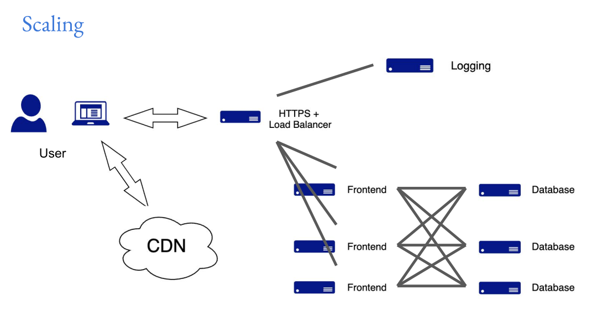

# Development, Scaling, and Service-Approach

Till now, we have been doing thing on our local machines. We have been running our applications on our local machines, which is great for development and testing. However, when we want to share our application with others or make it available to users, we need to deploy it to a server or a cloud platform. Deployment is the process of making our application available to users by hosting it on a server or a cloud platform. In this section, we will see how the development process transitions to deployment, how to scale applications, and the service-oriented approaches in modern application development.

## Deployment

Development of an application is the process of creation, testing, and refinement. Once the application is ready, it needs to be deployed to a production environment where users can access it. Deployment involves several steps, including:

1. **Idealization**: Understanding the requirements, planning the architecture, and designing the application. This is the initial phase where we conceptualize the application and its features.
2. **Development**: Writing code, creating features, and testing the application in a local environment. This is where the actual coding happens, and we build the application based on the design and requirements.
3. **Staging**: Setting up a staging environment that mimics the production environment. This is where we test the application in an environment that closely resembles the production environment to catch any issues before going live.
4. **Production**: Deploying the application to a live environment where users can access it. This is the final step where the application is made available to users, and we monitor its performance and usage.
5. **Maintenance**: Ongoing support, bug fixes, and updates to ensure the application continues to function well and meets user needs. This is an important phase where we keep the application up-to-date and address any issues that arise after deployment.

### Pros and Cons of Deployment

| Pros of Deployment | Cons of Deployment |
|--------------------|--------------------|
| Makes the application accessible to users | Can be complex and time-consuming |
| Allows for real-world testing and feedback | Requires ongoing maintenance and support |
| Enables scalability and performance optimization | Can be costly, especially for cloud services |
| Facilitates collaboration and version control | Security concerns and vulnerabilities |
| Provides always-on availability for users | Potential for downtime during deployment |

## Scaling

As our application grows in popularity, we may need to handle increased traffic and user load. Scaling is the process of adjusting the resources allocated to our application to accommodate more users and ensure optimal performance. There are two main types of scaling:

1. **Vertical Scaling**: Adding more resources (CPU, RAM) to a single server to handle increased load. This is a straightforward approach but has limitations as there is a maximum capacity for a single server.
2. **Horizontal Scaling**: Adding more servers to distribute the load across multiple machines. This approach is more flexible and can handle a larger number of users, but it requires more complex infrastructure and management.

### Load Balancing

To effectively manage traffic in a horizontally scaled environment, we use load balancers. A load balancer distributes incoming network traffic across multiple servers to ensure no single server becomes overwhelmed. This helps improve the performance and reliability of the application by ensuring that traffic is evenly distributed and that resources are utilized efficiently.

We can also add a **cdn (Content Delivery Network)** to further enhance the performance of our application by caching content closer to users, reducing latency and improving load times.

## Service-Approach

In modern application development, we often use a service-oriented approach to design and build applications. This approach involves breaking down the application into smaller, independent services that can be developed, deployed, and scaled independently. Some common service-oriented approaches include:

### SAAS (Software as a Service)

A software distribution model where applications are hosted by a service provider and made available to users over the internet. A user can access the application from anywhere with an internet connection. Examples include Google Workspace(google-sheets, google-docs, etc), Salesforce, and Dropbox. This approach allows users to use software without worrying about installation, maintenance, or infrastructure management, as everything is handled by the service provider.

### PAAS (Platform as a Service)

A cloud computing model that provides a platform allowing customers to develop, run, and manage applications without the complexity of building and maintaining the infrastructure like os and devices. Examples include Replit, Google App Engine, and Microsoft Azure. This approach allows developers to focus on coding and application development while the platform handles the underlying infrastructure, scaling, and maintenance.

### IAAS (Infrastructure as a Service)

A cloud computing model that provides virtualized computing resources over the internet. In this model, users have control over the operating system and applications, but not the underlying hardware. Examples include Amazon Web Services (AWS), Microsoft Azure, Linode, and Google Cloud Platform (GCP). This approach allows users to rent virtual machines, storage, and networking resources on a pay-as-you-go basis, providing flexibility and scalability without the need for physical hardware.

### Microservices Architecture

An architectural style that structures an application as a collection of small, loosely coupled services. Each service is responsible for a specific functionality and can be developed, deployed, and scaled independently. This approach allows for greater flexibility, scalability, and maintainability, as each service can be updated or replaced without affecting the entire application. Examples include Netflix, Amazon, and Spotify, which use microservices to handle different aspects of their applications such as user authentication, payment processing, and content delivery.

## Summary

In this section, we covered the transition from development to deployment, the importance of scaling applications to handle increased traffic, and the service-oriented approaches in modern application development. We discussed the lifecycle of deployment, the pros and cons of different deployment strategies, and how to effectively manage load with load balancers. We also explored various service models such as SAAS, PAAS, IAAS, and microservices architecture, which allow for greater flexibility and scalability in application development.
