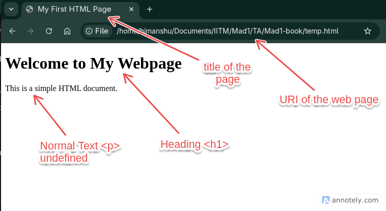

# HTML Introduction

HTML (HyperText Markup Language) is the standard markup language used to create web pages. It provides the structure and content of a webpage, allowing browsers to display text, images, links, and other multimedia elements. HTML5 is the current standard of HTML, introducing features and improvements for modern web development. In this section, we will cover the basics of HTML5, including its syntax and create a simple webpage.

## Basic Structure of an HTML Document

An HTML document consists of several key elements that define its structure. Here is a basic template for an HTML5 document:

Example of a Simple HTML Document:

```html
<!DOCTYPE html>
<html lang="en">
<head>
	<meta charset="UTF-8">
	<title>My First HTML Page</title>
</head>
<body>
	<h1>Welcome to My Webpage</h1>
	<p>This is a simple HTML document.</p>
</body>
</html>
```

Output:



### Explanation of the Code:

In the example above, we have the following key components:

- `<!DOCTYPE html>`: Declares the document type and version of HTML.
- `<html>`: The root element that contains all other HTML elements.
- `<head>`: Contains meta-information about the document, such as the title and links to stylesheets.
- `<meta charset="UTF-8">`: Specifies the character encoding for the document.
- `<title>`: Sets the title of the webpage, which appears in the browser tab.
- `<body>`: The body of the document is enclosed within the `<body>` tags. This is where the content that will be displayed on the webpage is placed.

	- Inside the `<body>`, we have a heading (`<h1>`) and a paragraph (`<p>`).
	- The `<h1>` tag defines a top-level heading. These headings range from `<h1>` to `<h6>`, with `<h1>` being the most important and largest and `<h6>` is the least important.
	- The `<p>` tag defines a paragraph of text. It can be used to display a block of normal text.
	- We will explore more HTML elements in the next section.

:::tip

**Try it yourself**

You can create your own HTML document by copying the example above into a text editor and saving it with a `.html` extension. Open the file in a web browser to see how it looks!

```html
<!DOCTYPE html>
<html lang="en">
<head>
	<meta charset="UTF-8">
	<title>My First HTML Page</title>
</head>
<body>
	<h1>Welcome to My Webpage</h1>
	<p>This is my first HTML document.</p>
</body>
</html>
```

:::

## Common HTML Elements

HTML provides a variety of elements to structure and format content. Here are some commonly used HTML elements:

- `<a>`: Defines a hyperlink.
- ``: Embeds an image.
- `<ul>`: Creates an unordered list.
- `<ol>`: Creates an ordered list.
- `<li>`: Defines a list item.
- `<div>`: A container element used to group other elements.
- `<span>`: An inline container used to style a part of the text.
- `<table>`: Creates a table to display data.
- `<form>`: Defines a form for user input.

In the next section, we will explore these elements in more detail and see how they can be used to create more complex webpages.

:::tip

- [HTML Basics](https://www.w3schools.com/html/html_basic.asp)
- [HTML5 Introduction](https://developer.mozilla.org/en-US/docs/Web/Guide/HTML/Introduction)
- [Creating a Simple HTML Page](https://youtu.be/PlxWf493en4?t=56) -> A video tutorial on creating a simple HTML page.

:::
