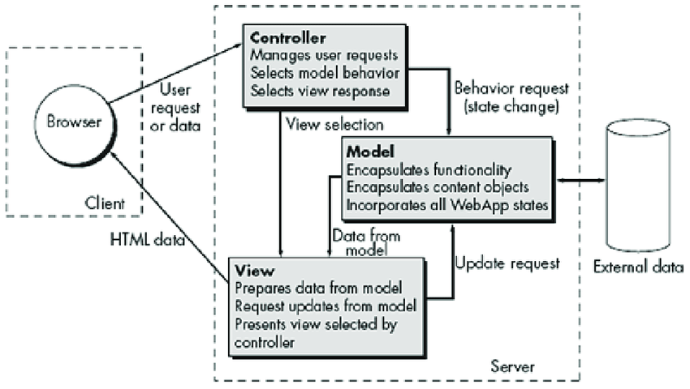

# MVC(Model-View-Controller)
MVC is a software architecture pattern that divides an interactive application into three independent components: Model (data & rules), View (presentation), and Controller (interaction logic).
This separation improves modularity, maintainability, scalability, and testability.

<!-- It was originally introduced by *Trygve Reenskaug* while working at *Xerox PARC Smalltalk* in the late 1970s. -->

::: info Core idea
What the system knows → **Model**
How it looks → **View**
How it responds to user actions → **Controller**
1. MVC enforces this separation of concerns so that:
- UI changes don’t break business logic & without the model ever knowing
- database changes should be possible without views every knowing
- Business logic is not mixed with HTML templates
2. State of interaction maintained as part of overall system memory
3. The web in general does not have the close knit structure of GUI applications
needed for MVC so be flexible.
:::

:::tabs

== Model
**What application knows (data and rules)**
- Stores Core data for the application and the validation constraints on data
- Defines relationships between objects
- Ex: `price >= 0 in Product Table, ID must be unique in User Table`
- Performs data manipulation and querying
- Communicates with databases, files, or external data-APIs

== View
**What user sees (how the model is visually presented)**
- User-interface of application
- Defines how information (received from Controller/Model) is presented (`View` is not concerned about how it is stored/processed)
- It can display selected attributes by asking Model(hides the non-relevant columns for the page) **presentation filter**
- A View does not control application flow
- Ex: `HTML pages, server-side templates, forms, rendered charts`

== Controller
**What the app does? What should happen on user request? Acts as the bridge between the user and the system**
- “Business logic” - how to manipulate data
- Handles user input (clicks, forms, commands) 
- Translates user actions (via buttons & menus) into appropriate messages, communicate these messages to Model and/or Views. Generally NEVER talk to a database directly.
- Decides which View should be displayed in appropriate places on screen (which role dashboard to show after login)
Examples: Validating input and triggering model updates
-
:::

User uses  Controller  → updates the  Model  → Controller selects a  View  → **User** sees rendered data

::: details
1. User fills Register form and clicks “Submit”
2. Request goes to the Controller
	- validates input (`unique email address, integer 10-digit phone number`)
	- Sends update request to the Model with new user record
3. `Model` updates the database
4. `Controller` chooses an appropriate View.
5. `View` renders updated `Model` data
6. User sees the result
:::

## Spreadsheets vs RDBMS vs NoSQL

| Feature                        | **Spreadsheets (Excel / Google Sheets)**                                                                                                     | **RDBMS (SQL Databases)**                                                               | **NoSQL (MongoDB, CouchDB)**                                                             |
| ------------------------------ | -------------------------------------------------------------------------------------------------------------------------------------------- | --------------------------------------------------------------------------------------- | ---------------------------------------------------------------------------------------- |
| **Lookup & Cross-Referencing** | Possible using formulas like `VLOOKUP`, `INDEX/MATCH`, but becomes **harder** as data grows or multiple files | Powerful **JOINs**; relationships are clearly defined using **foreign keys** | Cross-referencing **not as natural** as `JOIN`; data is often duplicated (for performance) |
| **Data Relationships**         | Not automatic relationships; users must manually ensure   | **Strongly enforced** relationships using constraints                                   | Relationships are usually handled **in application code**, not the database              |
| **Stored Procedures / Logic**  | Limited to basic formulas & scripts (VBA, Google Apps Script)    | **Rich support**: stored `PROCEDURE`, `TRIGGER`, `FUNCTION`                                | Usually **no stored procedures**; limited server-side scripting                          |
| **Business Logic Support**     | Not suitable for complex or reusable logic   | Ideal for business rules, validations, automation                                       | Logic mostly lives in the application layer                                              |
| **Atomic Operations**          | No true atomicity; partial updates can occur                                                                                                 | **Fully atomic (ACID transactions)**                                                    | Atomic at **document level only**   |
| **Failure Handling**           | Manual recovery needed   | Automatic rollback on failure    | Rollback across multiple documents is limited                                            |
| **Scalability**                | Poor for large datasets                                                                                                                      | Scales well vertically, moderately horizontally                                         | Designed for **horizontal scaling**                                                      |
| **Best Use Case**              | Small data, analysis, quick calculations                                                                                                     | Structured data, ERP, banking like *Paypal, Visa, Oracle*      | used alongside SQL for Big data, flexible schemas, high-traffic aspects of *Instagram, Netflix, Youtube, Twitter, Swiggy*   |

