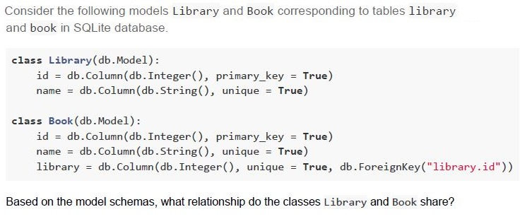

# Flask-sqlalchemy Relationships

::: warning Foreign key column goes on the "many" side in one-to-many (or many-to-one)
##### Many-to-One (Many articles belong to one user)
```python
class User(db.Model):
    __tablename__ = 'user'
    user_id = db.Column(db.Integer, autoincrement=True, primary_key=True)
    username = db.Column(db.String, unique=True)
    email = db.Column(db.String, unique=True)
    articles = db.relationship("Article", back_populates="author")  # One user to many articles

class Article(db.Model):
    __tablename__ = 'article'
    article_id = db.Column(db.Integer, primary_key=True, autoincrement=True)
    title = db.Column(db.String)
    content = db.Column(db.String)
    user_id = db.Column(db.Integer, db.ForeignKey("user.user_id"))  # Foreign key in Article
    author = db.relationship("User", back_populates="articles")  # Many articles to one user
```
##### Many-to-Many

```python
class User(db.Model):
    __tablename__ = 'user'
    user_id = db.Column(db.Integer, autoincrement=True, primary_key=True)
    username = db.Column(db.String, unique=True)
    email = db.Column(db.String, unique=True)
    articles = db.relationship("Article", secondary="article_authors", back_populates="authors")

class Article(db.Model):
    __tablename__ = 'article'
    article_id = db.Column(db.Integer, primary_key=True, autoincrement=True)
    title = db.Column(db.String)
    content = db.Column(db.String)
    authors = db.relationship("User", secondary="article_authors", back_populates="articles")

class ArticleAuthors(db.Model):
    __tablename__ = 'article_authors'
    user_id = db.Column(db.Integer, db.ForeignKey("user.user_id"), primary_key=True, nullable=False)
    article_id = db.Column(db.Integer, db.ForeignKey("article.article_id"), primary_key=True, nullable=False)
```

- Use `db.relationship()` for convenience, especially for bidirectional access.
- For many-to-many, use an association table with two foreign keys and `secondary` in relationships.
#### one-to-one
add `unique=True` constraint on the foreign key column.

:::