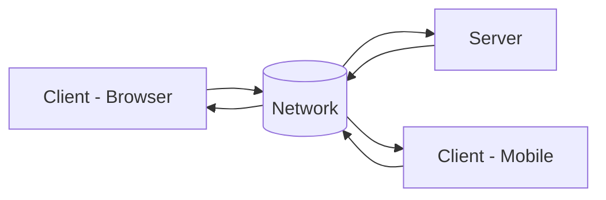
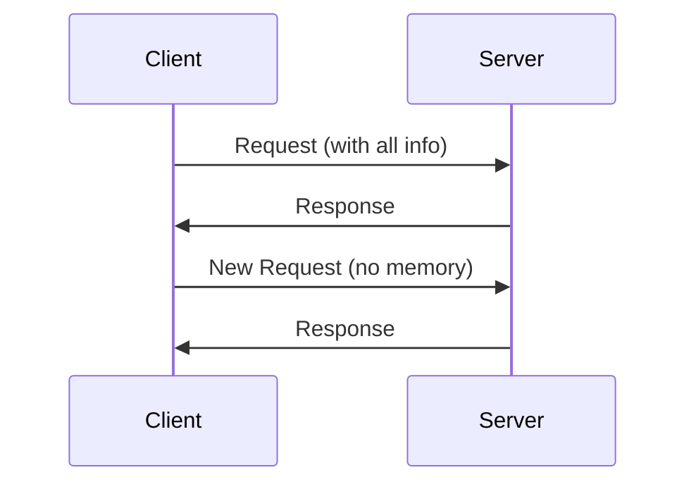
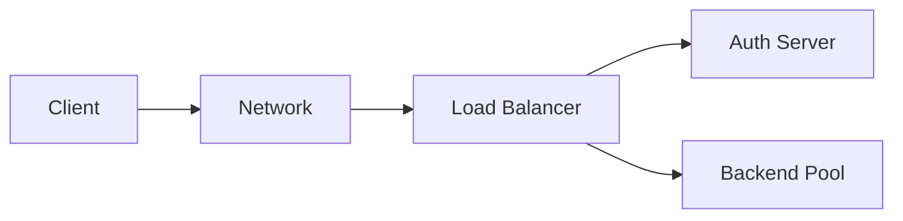
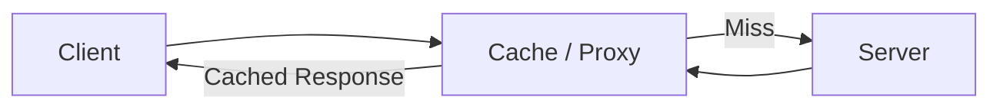

# Distributed Software Architecture

Distributed software architecture is a system design approach in which application components run on multiple machines and communicate over a network.

- Components run on **different systems**
- Communication happens via **network protocols (HTTP, TCP, etc.)**
- Enables **scalability** (handling increased load by adding machines) and **fault tolerance** (system continues working even if some components fail).


### Web Architecture

The structure used to design, build, and deliver web applications over the internet. using technologies like **HTML, CSS, JavaScript, HTTP**.

- Clients and servers may be **geographically far apart**
- Network conditions vary (latency, speed), can be **unreliable**


### Client–Server Responsibilities
:::tabs
== Client

- User interface
- Sends requests
- Displays response

== Server

- Stores data
- Processes business logic and handles requests
- Returns results

:::




---

# Assumptions in Distributed Systems

1. Server is **not always on**
2. The server **does not maintain client state** between requests (**stateless** interaction).
3. Authentication is **not automatic** (must be handled explicitly by tokens/sessions)
4. Network latency is **unpredictable**


# REST Architecture 

An API (Application Programming Interface) is a set of rules and protocols that allows different software systems to communicate and exchange data

- REST = **REpresentational State Transfer**
- A **set of design constraints**, not strict rules
- Designed to work efficiently over HTTP and handle real-world web constraints such as **latency, scalability, and stateless** communication.


## REST Constraints


### 1 Client–Server
Separation of concerns

- Client → UI & interaction
- Server → data & logic
- Independent development
- network can be `local`, not alter just connects client to server.


### 2: Stateless

Each request is independent
- Server does NOT remember past requests
- Client must send **all required data every time**, we can't assume it is the same server answering us.
- Server does not know:
  - which page user was on
  - if user is logged in (unless token is sent)





### 3: Layered System

The system is organized into multiple layers, where each layer has a specific responsibility.

#### Typical Components

- Load Balancer
- Authentication Server
- Backend Servers
- Divide app into view, controller and model. [MVC](../week4/4-database-layer-MODEL.md)
##### Benefits
Can make changes in one layer without affecting other, making it secure and easier to maintain or debug errors.
- reuse components
- modular design



---

### 4: Cacheability

Responses can be stored (cached)

#### Benefits

- Faster responses
- Reduced server load

- Example: Browser caches images, CSS




- `Cache-Control`
- `Expires`

---

### 5: Uniform Interface


Standard way of communication between client-server.

### Rules

- In REST APIs, **URLs represent resources** (e.g., /books, /students) rather than actions. Use standard HTTP methods:

| Method | Purpose |
| ------ | ------- |
| GET    | Read    |
| POST   | Create  |
| PUT    | Update  |
| DELETE | Remove  |

#### Benefits

- Simplicity
- Consistency
- Easy to understand APIs

---

#### 6. Code on Demand

Server can send executable code. Example:
- JavaScript
- Applets

## Summary Table

| Constraint        | Purpose                     |
| ----------------- | --------------------------- |
| Client-Server     | Separation of concerns      |
| Stateless         | No memory on server         |
| Layered           | Modular system              |
| Cacheable         | Improve performance         |
| Uniform Interface | Standard communication      |
| Code on Demand    | Extend client functionality |

---

# REST (REpresentational State Transfer)

- Client - Server may be far apart & State?
- Different networks, latencies, quality
- Authentication? Not core part of protocol
- guidelines & constraints

### What is REST?

- REST is an **architectural style** for designing web services.
- Uses **HTTP methods** to operate on **resources**.
- Resources are identified using **URIs (Uniform Resource Identifiers)**.
- Communication happens in a **client–server model**.


#### What does it actually mean?

- Every request from client → server must include **all required information (state)**.
- Server does **not remember previous requests**.
- This is called **stateless communication**.

::: info
- Everything is a **resource** (user, product, order, etc.)
- Each resource has:

  - A **URI**
  - A **representation** (JSON, XML, etc.)

```
GET /users/101
```

→ Fetch user with ID 101

:::

### REST Communication Flow (Sequence)

1. **Client accesses resource**

   - Uses URI (e.g., `/users/101`)
   - No prior state assumed

2. **Client specifies operation**

   - Using HTTP methods:

     - GET, POST, PUT, DELETE

3. **Server processes request**

   - Applies business logic
   - Interacts with database if needed

4. **Server sends response**

   - Returns:

     - Data (JSON/XML)
     - Status codes (200, 404, etc.)
     - Links to other resources (HATEOAS – optional advanced concept)

| Aspect             | CRUD                         | REST                         |
| ------------------ | ---------------------------- | ---------------------------- |
| **Definition**     | Basic database operations    | Architectural style for APIs |
| **Scope**          | Database level               | Web/API level                |
| **Operations**     | Create, Read, Update, Delete | Uses HTTP methods            |
| **Protocol**       | Not tied to any protocol     | Uses HTTP                    |
| **Focus**          | Data manipulation            | Resource-based communication |
| **Implementation** | SQL / ORM / DB logic         | APIs using URIs + HTTP       |
| **State**          | Internal DB state            | Stateless communication      |

- REST ≠ CRUD
- But:

  - REST **maps well to CRUD operations**

##  Idempotent Operations
- An operation is **idempotent** if:

  - Repeating it multiple times → same result as once

### Idempotent

- GET
- PUT
- DELETE
- HEAD
- OPTIONS

### Non-Idempotent

- POST
- PATCH


## Typical REST API Functionality

- CRUD operations
- Filtering & listing
- Create VM
- Restart server
- Control IoT devices


### **Flask Application with Idempotency Handling**
```python
from flask import Flask, request, jsonify
from flask_sqlalchemy import SQLAlchemy

app = Flask(__name__)
app.config["SQLALCHEMY_DATABASE_URI"] = "sqlite:///users.db"
app.config["SQLALCHEMY_TRACK_MODIFICATIONS"] = False
db = SQLAlchemy(app)

# User model
class User(db.Model):
    id = db.Column(db.Integer, primary_key=True)
    name = db.Column(db.String(100), nullable=False)

# Initialize database
with app.app_context():
    db.create_all()

# ✅ IDEMPOTENT: PUT (Update or Create)
@app.route("/users/<int:user_id>", methods=["PUT"])
def update_user(user_id):
    data = request.get_json()
    user = User.query.get(user_id)
    
    if user:  # If user exists, update it
        user.name = data["name"]
    else:  # If user doesn't exist, create it (still idempotent)
        user = User(id=user_id, name=data["name"])
        db.session.add(user)

    db.session.commit()
    return jsonify({"id": user.id, "name": user.name}), 200

# ✅ IDEMPOTENT: DELETE (Always results in resource absence)
@app.route("/users/<int:user_id>", methods=["DELETE"])
def delete_user(user_id):
    user = User.query.get(user_id)
    
    if user:  # Delete if exists
        db.session.delete(user)
        db.session.commit()
        return jsonify({"message": "User deleted"}), 200
    else:  # If already deleted, response remains same
        return jsonify({"message": "User not found"}), 200

# ❌ NON-IDEMPOTENT: POST (Creates new entry every time)
@app.route("/users", methods=["POST"])
def create_user():
    data = request.get_json()
    new_user = User(name=data["name"])
    db.session.add(new_user)
    db.session.commit()
    return jsonify({"id": new_user.id, "name": new_user.name}), 201

# Run the app
if __name__ == "__main__":
    app.run(debug=True)
```

---
