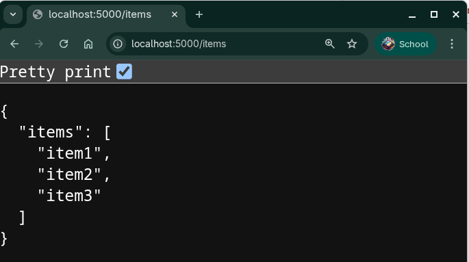
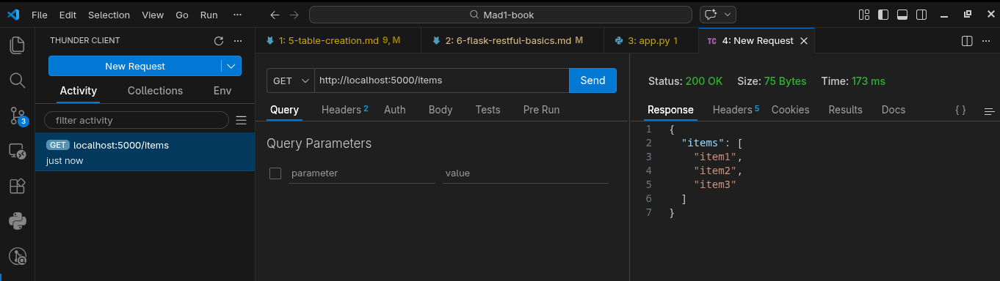
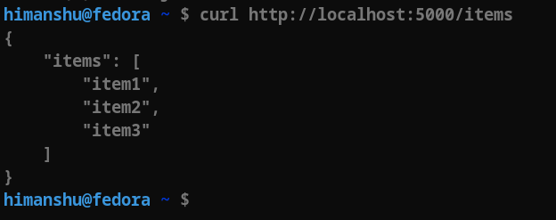

# Flask Restful and API Basics

In this section, we will learn about Flask Restful and how to create APIs using it. Flask Restful is an extension for Flask that adds support for quickly building REST APIs. It provides a simple way to create API endpoints and handle HTTP requests.

API stands for Application Programming Interface. It is a set of rules and protocols that allows different software applications to communicate with each other. In the context of web development, APIs are often used to allow clients (like web browsers or mobile apps) to interact with a server and access data or perform actions.

## SSR, CSR Applications and Need of APIs

There are two main componenets of an application:

- **Frontend**: The part of the application that interacts with the user. It is responsible for displaying data and handling user interactions. Examples of frontend technologies include HTML, CSS, JavaScript, and frontend frameworks like React, Angular, and Vue.js.
- **Backend**: The part of the application that runs on the server. It is responsible for processing requests, managing data, and performing business logic. Examples of backend technologies include Python, Node.js, Ruby, and backend frameworks like Flask, Django, and Express.

There are two main types of applications based on how the frontend and backend interact:

- **Server-Side Rendered (SSR) Applications**: In SSR applications, the server generates the HTML for each page and sends it to the client. The client then renders the page in the browser. This approach is simpler to implement but can be less efficient for dynamic content and may result in slower page loads due to the need to reload the entire page for each interaction.
- **Client-Side Rendered (CSR) Applications**: In CSR applications, the server provides an API that the client can use to fetch data. The client is responsible for rendering the HTML and updating the page dynamically based on user interactions. This approach can provide a better user experience and faster interactions, but it requires more complex frontend development. In CSR applications, client ask for very specific data from the server and the server responds with only that data, which is used to update the page dynamically without reloading the entire page. This is where APIs come into play. APIs allow the frontend to communicate with the backend and fetch the necessary data to update the user interface.

*API is a contract between the frontend and backend that defines how they will communicate with each other. It specifies the endpoints, request methods, and data formats that the frontend can use to interact with the backend.*

## Creating a API resource in plain Flask

Before we dive into Flask Restful, let's see how we can create an API resource using plain Flask. Here's an example of how to create a simple API that returns a list of items:

```python
from flask import Flask, jsonify, request

app = Flask(__name__)

@app.route('/items', methods=['GET'])
def items():
    if request.method == 'GET':
        return jsonify({'items': ['item1', 'item2', 'item3']})
    elif request.method == 'POST':
        # Here we would handle the logic for creating a new item based on the data sent in the request body.
        return jsonify({'message': 'Item created successfully'}), 201

if __name__ == '__main__':
    app.run(debug=True)
```

Now we can run this script and access the API by navigating to `http://localhost:5000/items` in our web browser or using a tool like `Postman` or `Thunder Client` or we can use `curl`. We should see a JSON response with the list of items.

:::tabs
== Browser

== Thunder Client
**click on the image to view in other page**
<a href="../static/week6/6-thunder-client.png" target="_blank" title="click to view on other page"></a>
== curl

:::

Here we have used `flask routes` to define the API endpoints and `jsonify` to return JSON responses. This approach works, but as our API grows in complexity, it can become difficult to manage and maintain. This is where Flask Restful comes in handy, providing a more structured way to create API resources and handle different HTTP methods.

### Browser Limitations and Api Testing Tools

Before we move on to Flask Restful, it's important to note that while we can test our API using a web browser, it has limitations. Browsers are primarily designed for rendering HTML and may not handle all HTTP methods (like POST, PUT, DELETE) or allow us to easily send data in the request body of a **html form**.

Without js feature like `fetch`, browser can only use `get` method (default) or `post` method in a **html form**. For testing APIs, we can use tools like:

- Postman
- Thunder Client
- curl
- HTTPie
- fetch (from javascript)
- axios (from javascript)
- requests (from python)

These tools allows us to send data and headers in our requests using different HTTP methods, making it easier to test our API endpoints and ensure they are working correctly. They also provide features like saving requests, organizing them into collections, and generating code snippets for different programming languages, which can be very helpful during development.

## Flask Restful

Flask Restful provides a more structured way to create API resources. It allows us to define resources as classes and handle different HTTP methods (GET, POST, PUT, DELETE) in a more organized manner. This can make our code cleaner and easier to maintain, especially as our API grows in complexity.

### Setting Up Flask Restful

To get started with Flask Restful, we need to install it first. we can do this using pip:

```bash
pip install flask-restful
```

or if you are using uv:

```bash
uv add flask-restful
```

### Creating a Basic API

Once we have Flask Restful installed, we can create a basic API. Here’s an example of how to create a simple API that returns a list of items:

```python
from flask import Flask
from flask_restful import Resource, Api

app = Flask(__name__)
api = Api(app)

class ItemList(Resource):
    def get(self):
        return {'items': ['item1', 'item2', 'item3']}
        
api.add_resource(ItemList, '/items')

if __name__ == '__main__':
    app.run(debug=True)
```

In this example, we define a resource class called `ItemList` that has a `get` method. This method returns a JSON response containing a list of items. We then add this resource to our API and specify the endpoint `/items`.

### Running the API

To run the API, simply execute the script. We can then access the API by navigating to `http://localhost:5000/items` in our **web browser** or using a tool like `Postman` or `Thunder Client` or we can use `curl`. We should see a JSON response with the list of items.

```json
{
    "items": ["item1", "item2", "item3"]
}
```

## Flask Restful Features

Flask Restful provides several features that make it easier to build APIs:
:::details click to expand

- **Resource Classes**: We can define resources as classes, which allows us to organize our code better and handle different HTTP methods in a more structured way.
- **Request Parsing**: Flask Restful provides a built-in request parsing mechanism that allows us to easily extract data from incoming requests.
- **Error Handling**: Flask Restful has built-in error handling, which allows us to return appropriate error messages and status codes when something goes wrong.
- **Serialization**: Flask Restful can automatically serialize our data into JSON format, making it easier to return responses to clients.
- **Authentication**: Flask Restful can be easily integrated with authentication mechanisms to secure our API endpoints.
- **Pagination**: Flask Restful can help us implement pagination for our API responses, which is useful when dealing with large datasets.
- **Testing**: Flask Restful provides tools for testing our API endpoints, making it easier to ensure that our API is working correctly.
- **Documentation**: Flask Restful can be integrated with tools like Swagger to automatically generate documentation for our API endpoints.
- **Extensibility**: Flask Restful is designed to be extensible, allowing us to add custom functionality as needed.
- **Integration with Flask**: Since Flask Restful is an extension of Flask, it integrates seamlessly with the Flask ecosystem, allowing us to use other Flask extensions and features in our API development.
:::

In summary, Flask Restful is a powerful extension for Flask that makes it easier to build REST APIs. It provides a structured way to define resources and handle HTTP requests, making our code cleaner and more maintainable. With its various features, Flask Restful can help us create robust and scalable APIs for our applications.

## Resource Classes and HTTP Methods

In Flask Restful, we define resources as classes that inherit from the `Resource` class. Each resource class can have methods that correspond to different HTTP methods (GET, POST, PUT, DELETE). This allows us to handle different types of requests in a clean and organized way. After defining our resource classes, we need to add them to our API with the appropriate endpoints. For example, we can define a resource class for managing items in our API:

```python
from flask import Flask
from flask_restful import Resource, Api

app = Flask(__name__)
api = Api(app)

class Item(Resource):
    def get(self, item_id):
        return {'item': f'item{item_id}'}
    
    def post(self):
        return {'message': 'Item created successfully'}, 201
    
    def put(self, item_id):
        return {'message': f'Item {item_id} updated successfully'}
    
    def delete(self, item_id):
        return {'message': f'Item {item_id} deleted successfully'}

api.add_resource(Item, '/item/<int:item_id>', '/item')

if __name__ == '__main__':
    app.run(debug=True)
```

In this example, we have defined a resource class called `Item` that has methods for handling GET, POST, PUT, and DELETE requests. We then add this resource to our API with two endpoints: `/item/<int:item_id>` for GET, PUT, and DELETE requests, and `/item` for POST requests. This allows us to manage items in our API using different HTTP methods.

:::info A Question for you

- Think why we have two endpoints for the same resource?
- Why post method does not have an item_id in the endpoint?

:::details View Answer

We have two endpoints for the same resource because the POST method is used to create a new item, and it does not require an item_id in the endpoint. The item_id is typically generated by the server when a new item is created. On the other hand, the GET, PUT, and DELETE methods require an item_id in the endpoint to specify which item we want to retrieve, update, or delete. This allows us to manage individual items in our API using their unique identifiers.
:::

In summary, resource classes in Flask Restful allow us to define how our API will handle different HTTP methods for specific endpoints. This structured approach makes it easier to manage our API and ensures that our code is organized and maintainable.

## Request Parsing

Request parsing is the process of extracting data from incoming HTTP requests. Flask Restful provides a built-in request parsing mechanism that allows us to easily extract data from requests and validate it. This is especially useful when we want to handle POST or PUT requests where the client sends data to the server.

Data sent by the client can be in various formats, such as JSON, form data, or query parameters and can be malicious. Therefore, it is important to validate the incoming data to ensure that it meets our requirements and does not cause any issues in our application.

Flask Restful provides a `reqparse` module that allows us to define the expected parameters and their types. We can also specify whether a parameter is required or optional. Here's an example of how to use `reqparse` to parse incoming data:

```python
from flask import Flask
from flask_restful import Resource, Api, reqparse

app = Flask(__name__)
api = Api(app)

parser = reqparse.RequestParser()
parser.add_argument('name', type=str, required=True, help='Name of the item is required')
parser.add_argument('price', type=float, required=True, help='Price of the item is required')

class Item(Resource):
    def post(self):
        args = parser.parse_args()  # process the incoming request and extract the data based on the defined arguments
        
        name = args['name']
        price = args['price']
        
        return {'message': f'Item {name} with price {price} created successfully'}, 201

api.add_resource(Item, '/item')

if __name__ == '__main__':
    app.run(debug=True)
```

In this example, we define a POST method for the `Item` resource. We create a `RequestParser` object and add expected parameters (`name` and `price`) with their types and validation rules. When a POST request is made to the `/item` endpoint, the parser will extract the data from the request, validate it, and return an appropriate response. If any required parameter is missing or if the data type is incorrect, Flask Restful will automatically return an error message with a 400 status code.

:::details More about Reqparse Object

The `RequestParser` object in Flask Restful is a powerful tool for handling and validating incoming request data. It allows us to define the expected parameters, their types, and validation rules in a clean and organized way. Here are some key features of the `RequestParser` object:

### Adding Arguments

We can add expected parameters using the `add_argument` method. This method takes the name of the parameter, its type, whether it is required, and an optional help message for validation errors. Each argument can have various parameters defining the rules for the expected data:

- `type`: Specifies the expected data type (e.g., `str`, `int`, `float`).
- `required`: Indicates whether the parameter is required (default is `False`).
- `help`: Provides a custom error message if the validation fails.
- `default`: Specifies a default value for the parameter if it is not provided in the request.
- `choices`: Defines a list of valid values for the parameter.
- `location`: Specifies where to look for the parameter (e.g., `json`, `args`, `form`).

### Parsing Arguments

Once we have defined our expected parameters, we can call the `parse_args` method to extract the data from the incoming request. This method will validate the data based on the rules we defined and return a dictionary of the parsed arguments. If any validation fails, it will automatically return an error response with a 400 status code.

### Example of Using `RequestParser`

```python
from flask import Flask
from flask_restful import Resource, Api, reqparse

app = Flask(__name__)
api = Api(app)

parser = reqparse.RequestParser()
parser.add_argument('name', type=str, required=True, help='Name of the item is required')
parser.add_argument('price', type=float, required=True, help='Price of the item is required')
parser.add_argument('category', type=str, choices=['electronics', 'clothing', 'food'], help='Category must be one of: electronics, clothing, food')

class Item(Resource):
    def post(self):
        
        args = parser.parse_args()
        
        name = args['name']
        price = args['price']
        category = args['category']
        
        return {'message': f'Item {name} with price {price} in category {category} created successfully'}, 201

api.add_resource(Item, '/item')

if __name__ == '__main__':
    app.run(debug=True)
```

:::warning Deprication Note
The `reqparse` module in Flask Restful is now considered deprecated. It is recommended to use other libraries such as `marshmallow` or `pydantic` for request parsing and validation in modern Flask applications. These libraries provide more powerful and flexible ways to handle data validation and serialization, making them a better choice for new projects.
:::

## Frontend Integration

Now that we know how to create an API and parse the incoming requests, we can integrate our Flask Restful API with a frontend application. This allows us to create dynamic web applications that can interact with our API to fetch and display data, as well as send data back to the server.

For now let's assume that we are handling only form data in our API. We can create a simple HTML form that allows users to submit data to our API. Here's an example of how to create a basic HTML form that interacts with our Flask Restful API:

```html
<!DOCTYPE html>
<html lang="en">
<head>
    <meta charset="UTF-8">
    <meta name="viewport" content="width=device-width, initial-scale=1.0">
        <title>Flask Restful API Form</title>
</head>
<body>
    <h1>Submit Item</h1>
    <form action="/item" method="post">
        <label for="name">Item Name:</label>
        <input type="text" id="name" name="name" required><br><br>
        <label for="price">Price:</label>
        <input type="number" id="price" name="price" step="0.01" required><br><br>
        <input type="submit" value="Submit">
    </form>
</body>
</html>
```

python code for handling the form data in the API:

```python
from flask import Flask, request
from flask_restful import Resource, Api

app = Flask(__name__)
api = Api(app)

item_parser = reqparse.RequestParser()
item_parser.add_argument('name', type=str, required=True, help='Name of the item is required')
item_parser.add_argument('price', type=float, required=True, help='Price of the item is required')

class Item(Resource):
    def post(self):
        args = item_parser.parse_args()
        name = args['name']
        price = args['price']
        return {'message': f'Item {name} with price {price} created successfully'}, 201

api.add_resource(Item, '/item')

if __name__ == '__main__':
    app.run(debug=True)
```

In this example, we have created a simple HTML form that allows users to submit an item name and price. The form sends a POST request to the `/item` endpoint of our Flask Restful API when the user submits the form. The API then parses the incoming data using `reqparse`, validates it, and returns a response indicating that the item was created successfully. This integration allows us to create a dynamic web application that can interact with our API to manage items.

## Database Integration

Flask Restful can be easily integrated with databases to store and retrieve data for our API. We can use libraries like SQLAlchemy or Flask-SQLAlchemy to manage our database interactions. This allows us to create more complex APIs that can handle persistent data storage. For example, we can define a database model for our items and use it to create, read, update, and delete items in our API. Here's a simple example of how to integrate Flask Restful with a database using Flask-SQLAlchemy:

```python
from flask import Flask
from flask_restful import Resource, Api, reqparse
from flask_sqlalchemy import SQLAlchemy

app = Flask(__name__)
app.config['SQLALCHEMY_DATABASE_URI'] = 'sqlite:///items.db'
db = SQLAlchemy(app)
api = Api(app)

parser = reqparse.RequestParser()
parser.add_argument('item_name', type=str, required=True, help='Name of the item is required')

class User(db.Model):
    id = db.Column(db.Integer, primary_key=True)
    name = db.Column(db.String(80), nullable=False)
    purchase = db.relationship('Purchase', back_populates='user', lazy='selectin')

class Purchase(db.Model):
    id = db.Column(db.Integer, primary_key=True)
    item_name = db.Column(db.String(80), nullable=False)
    user_id = db.Column(db.Integer, db.ForeignKey('user.id'), nullable=False)
    user = db.relationship('User', back_populates='purchase', lazy='joined')
    # I hope you remember these parameters from the previous weeks. If not, please review the SQLAlchemy section in week 5.

class UserApi(Resource):
    def get(self, user_id):
        user = User.query.get(user_id)
        if user:
            return {'user': user.name, 'purchases': [purchase.item_name for purchase in user.purchase]}
        else:
            return {'message': 'User not found'}, 404
    
    def post(self):
        # Here we would get the data from the request and create a new user.
        request_data = {'name': 'new_user'}  # This is just a placeholder. In a real application, you would get this data from the request body.
        user = User(name=request_data['name'])
        db.session.add(user)
        db.session.commit()
        return {'message': f'User {user.name} created successfully'}, 201

    def patch(self, user_id):
        user = User.query.get(user_id)
        if user:
            # Here we would get the data from the request and update the user's information.
            user.name = 'updated_user'
            db.session.commit()
            return {'message': f'User {user.name} updated successfully'}
        else:
            return {'message': 'User not found'}, 404

class ItemApi(Resource):
    def get(self, item_id):
        item = Purchase.query.get(item_id)
        if item:
            return {'item': item.item_name, 'user': item.user.name}
        else:
            return {'message': 'Item not found'}, 404

    # here in post request we are taking user_id as a path parameter and item details in the request body. We will use these details to create a new purchase record in the database.
    def post(self, user_id):
        
        args = parser.parse_args()

        user = User.query.get(user_id)
        if not user:
            return {'message': 'User not found'}, 404
        
        new_purchase = Purchase(item_name=args['item_name'], user=user)
        db.session.add(new_purchase)
        db.session.commit()
        
        return {'message': f'Item {args["item_name"]} purchased by user {user.name} successfully'}, 201
    
    def delete(self, item_id):
        item = Purchase.query.get(item_id)
        if item:
            db.session.delete(item)
            db.session.commit()
            return {'message': 'Item deleted successfully'}
        else:
            return {'message': 'Item not found'}, 404

api.add_resource(ItemApi, '/item/<int:item_id>')
api.add_resource(UserItemApi, '/user/<int:user_id>/item')

if __name__ == '__main__':
    with app.app_context():
        db.create_all()  # Create the database tables
    app.run(debug=True)
```

In this example, we have defined two database models: `User` and `Purchase`. The `Item` resource class has methods for handling GET, POST, and DELETE requests. The GET method retrieves an item from the database based on its ID, while the POST method creates a new purchase record for a user. The DELETE method allows us to delete an item from the database. This integration with a database allows us to create a more dynamic and persistent API.

## Response Handling

In Flask Restful, we can easily return responses to clients in JSON format. When we return a dictionary from our resource methods, Flask Restful automatically converts it to JSON and sets the appropriate content type. We can also specify the HTTP status code for our responses.

For example, when we create a new item in our API, we can return a success message along with a 201 status code to indicate that the item was created successfully:

```python
return {'message': f'Item {name} with price {price} created successfully'}, 201
```

In this example, we are returning a JSON response with a message and a status code of 201, which indicates that the item was created successfully. Flask Restful will handle the conversion to JSON and set the appropriate headers for us. We can also return different status codes based on the outcome of our operations. For example, if we try to retrieve an item that does not exist, we can return a 404 status code to indicate that the item was not found:

```python
return {'message': 'Item not found'}, 404
```

### marshalling the response

Flask Restful also provides a way to marshal our responses using the `marshal_with` decorator. This allows us to define a structure for our responses and ensure that they are consistent across our API. We can define a resource field structure and use it to format our responses. Here's an example of how to use `marshal_with`:

```python
from flask_restful import fields, marshal_with

item_fields = {
    'name': fields.String,
    'price': fields.Float,
    'category': fields.String
}

class Item(Resource):
    @marshal_with(item_fields)
    def get(self, item_id):
        item = Purchase.query.get(item_id)
        if item:
            return item
        else:
            return {'message': 'Item not found'}, 404
```

In this example, we define a resource field structure called `item_fields` that specifies the expected fields in our response. We then use the `@marshal_with` decorator on our GET method to indicate that the response should be formatted according to the defined structure. This helps ensure that our API responses are consistent and well-structured.

### Marshall and Marshal_with

The `marshal` function in Flask Restful is used to format a response according to a specified structure. It takes a data object and a resource field structure as arguments and returns a formatted response. The `marshal_with` decorator is a convenient way to apply the `marshal` function to the return value of a resource method. It allows us to define the expected structure of our responses and ensures that all responses from that method are formatted consistently. When we use `marshal_with`, we define a resource field structure that specifies the fields and their types that we want to include in our response. The `marshal_with` decorator then automatically applies the `marshal` function to the return value of the decorated method, ensuring that the response is formatted according to the defined structure. This helps maintain consistency in our API responses and makes it easier for clients to consume our API.

```python
from flask_restful import fields, marshal_with
item_fields = {
    'name': fields.String,
    'price': fields.Float,
    'category': fields.String
}

class Item(Resource):
    def get(self, item_id):
        item = Purchase.query.get(item_id)
        if item:
            return marshal({'name': item.item_name, 'price': 10.99, 'category': 'electronics'}, item_fields)
        else:
            return {'message': 'Item not found'}, 404
```

In this example, we are using the `marshal` function directly in the GET method to format the response according to the `item_fields` structure. This achieves the same result as using the `@marshal_with` decorator, but it allows us to have more control over when and how we apply the marshalling to our responses.

## Error Handling

Flask Restful has built-in error handling that allows us to return appropriate error messages and status codes when something goes wrong. If we raise an exception in our resource methods, Flask Restful will catch it and return a JSON response with the error message and a 500 status code by default. We can also define custom error handlers to return specific responses for different types of errors. For example, we can define a custom error handler for 404 errors to return a more user-friendly message:

```python
from flask import Flask
from flask_restful import Resource, Api

app = Flask(__name__)
api = Api(app)

@app.errorhandler(404)
def not_found(error):
    return {'message': 'The resource you are looking for was not found'}, 404

class Item(Resource):
    def get(self, item_id):
        item = Purchase.query.get(item_id)
        if item:
            return {'name': item.item_name, 'price': 10.99, 'category': 'electronics'}
        else:
            return {'message': 'Item not found'}, 404

api.add_resource(Item, '/item/<int:item_id>')

if __name__ == '__main__':
    app.run(debug=True)
```

In this example, we have defined a custom error handler for 404 errors that returns a JSON response with a custom message. When a GET request is made to the `/item/<int:item_id>` endpoint and the item is not found in the database, the API will return a 404 status code along with the custom error message defined in our error handler. This allows us to provide more informative and user-friendly error responses in our API.

Summary:

- Flask Restful is an extension for Flask that makes it easier to build REST APIs.
- We can define resources as classes and handle different HTTP methods in a structured way.
- Request parsing allows us to extract and validate data from incoming requests.
- We can integrate Flask Restful with databases to manage persistent data.
- Flask Restful provides built-in error handling and allows us to define custom error handlers for specific error scenarios.
- We can use the `marshal` function and `marshal_with` decorator to format our API responses consistently.