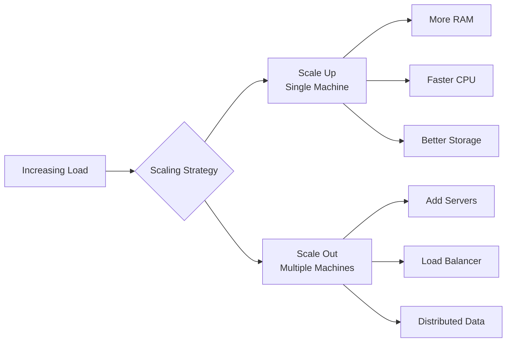
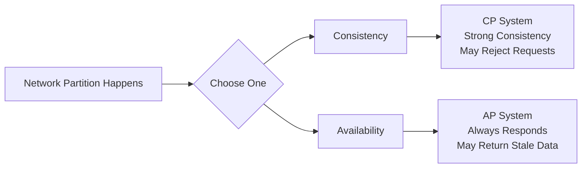
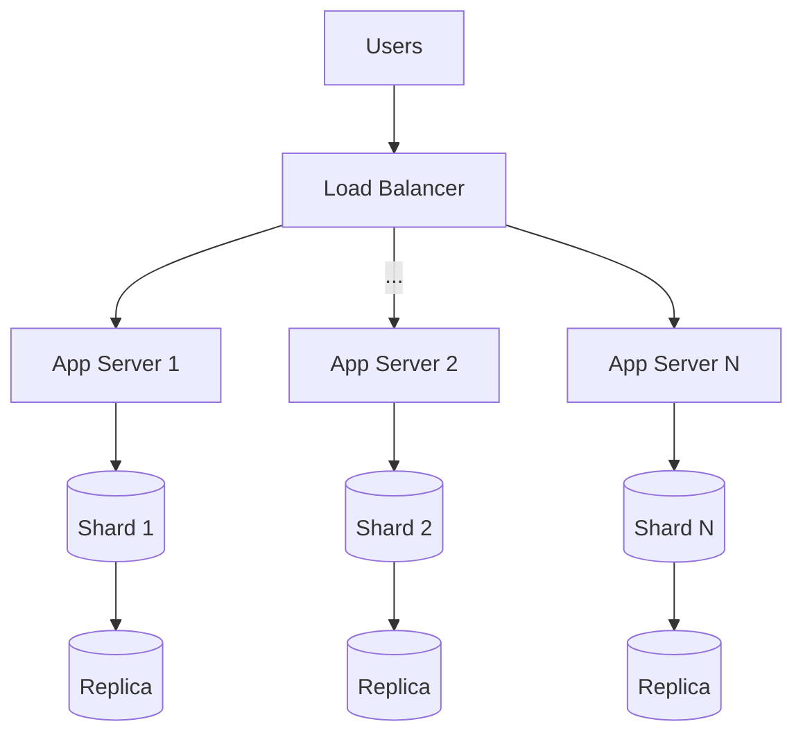

# Tabular (Relational) Databases

- Data is stored in **structured** tables (rows × columns)
- Each row = record, each column = attribute
- Example: MySQL, PostgreSQL
- Ensures ACID properties: Atomicity, Consistency, Isolation, and Durability.
- Supports complex queries (`JOIN, GROUP BY`)

## Indexing

- As tables grow large, quick searching becomes important:
  - **INDEX** is a data structure which is sorted or hashed representation of one or more columns with specific data types (e.g. `string/int/date`)
- **Fast lookup**: reduces search complexity from $O(N)$ (full scan) to $O(\log N)$ (B-tree) or $O(1)$ (hash index in ideal cases).
- Improves read performance at the cost of additional storage and slower write operations `INSERT/UPDATE`
- B-tree index supports prefix search `LIKE 'pattern%'` but NOT `LIKE '%pattern%'`
- Hash index supports only exact match (`=`), not pattern search  
- in-memory tables
  - ✅ equality comparisons ❌ range
  - ❌ `ORDER BY`
  - ❌ partial key prefix

:::details B-Tree Index

- Structure: Balanced tree (multi-level, disk-friendly)
- Search → $O(\log N)$
- Insert/Delete → $O(\log N)$
- Supports:
  - Equality: `=`
  - Range: `>, <, BETWEEN`
  - Prefix search: `LIKE 'abc%'`
- Does NOT support `LIKE '%abc'` efficiently:

Examples:

```sql
SELECT * FROM users WHERE age BETWEEN 20 AND 30;
SELECT * FROM users 
-- Index-friendly
WHERE name LIKE 'Yas%'

-- Not index-friendly
WHERE name LIKE '%Yas%'
```

- Maintains sorted order
- Optimized for magnetic disk by minimizing the number of disk I/O operations.
:::

:::details Hash Index (supports exact matching `=` only)

- Uses a hash function to map keys to index positions.
- does not support `< >` range queries, sorting `ORDER BY`, `LIKE` pattern or `LIKE 'mad%'` prefix queries
- `SELECT * FROM users WHERE name = 'Yashvi';` like for key-value lookups or in-memory database
:::


| Feature         | B-Tree Index                                     | Hash Index               |
| --------------- | ------------------------------------------------ | ------------------------ |
| Lookup          | avg $O(log N)$, best $O(1)$                      | avg $O(1)$, worst $O(N)$ |
| features        | range query `< >`, sorting, prefix `abc%` search | No                       |
| Exact Match `=` | Yes                                              | Yes                      |

```sql
-- Databases use the leftmost prefix rule for multi-column indexes
INDEX (A, B, C)

-- Efficient
WHERE A=1 AND B=2

-- Partial use
WHERE A=1

-- Not used
WHERE B=2
```

# NoSQL

NoSQL databases sacrifice strict consistency in some cases to achieve higher scalability and availability.


<div class="card">
<h3>📄Document Databases</h3>
<p>
<pre>MongoDB, Couchbase, Amazon DocumentDB</pre>
Store all related data together in a single document (denormalized).</p>
<p>Instead of multiple fixed size tables, a user and their borrowed books are stored together.</p>
<li>semi-structured as each document can have own schema unlike table</li>
<p><b>JSON key-value pairs</b>: obj, records, structs, lists, arrays, maps, dates</p>
<h5>Example Document</h5>

<ul>
	<li>No JOIN needed</li>
	<li>Fast reads for user data</li>
	<li>No data duplication possible</li>
</ul>
<h5>Query Example</h5>
<pre>db.users.find({ user_id: "1" })</pre>
</div>

<div class="card">
<h3>🔑 Key-Value Stores</h3>
<pre>Redis, DynamoDB, BerkeleyDB, Memcache</pre>
<p>Store data as simple key-value pairs<br>(Typically implemented using hash tables (O(1)). Some systems may use trees for range queries.
)</p>
<p>Direct access using a unique key (like a dictionary).</p>
<h5>Example</h5>
<pre>"user:1" → "{name: Baskaran, books: [B1, B2]}" 
"book:1" → "{title: DBMS}" </pre>
<ul>
	<li>in-memory extremely fast (O(1) lookup)</li>
	<li>Ideal for caching</li>
	<li>Does not support querying within values; access is only via keys</li>
	<li>No relationships for complex data</li>
</ul>
<h5>Query Example</h5>
<pre>GET user:1 SET user:1 "{name: Puneet, books:[B1,B2]}"</pre></div>

<div class="card">
<h3>Column Stores</h3>
<pre>Cassandra, HBase, BigTable</pre>
<p>Data is stored as collections of <b>column families</b> (variable number of columns).</p> 
<p> 
Data is stored in column families, where each row can have a <i>variable no. of columns</i> = <b>(key → value)</b>, where value is a <b>set of related columns</b>.<br> 
Each row/record contains ≥ 1 key-value pairs. </p> 
<h5> Example Table</h5> 
<table border="1" cellpadding="6"> <tr> <th>user_id (key)</th> <th>book_id</th> <th>borrow_date</th> </tr> <tr> <td>U101</td> <td>B1</td> <td>2026-03-01</td> </tr> <tr> <td>U101</td> <td>B2</td> <td>2026-03-10</td> </tr> </table> 
<ul> 
<li> Stores <b>sparse, sorted columns</b> efficiently</li>
<li>Scales to large datasets</li>
<li>Not ideal for ACID-heavy work</li>
</ul>
<h5>Query Example</h5>
<pre>SELECT book_id, borrow_date 
FROM borrow_history 
WHERE user_id = '1'; </pre>

</div>

<div class="card">
<h3>Graph Databases</h3>
<pre>Neo4J, Amazon Neptune, OrientDB</pre>
<p>
Data is represented as a graph:
<b>G = (V, E)</b>
</p>

<ul>
<li>V → Nodes (entities with properties/IDs)</li>
<li>E → Edges (relationships with labels/roles)</li>
</ul>

<p>
Both nodes and edges store <b>key-value properties</b>.
<p><b>Degree of a node</b>: number of relationships connected to it.</p>
</p>
<p>Used for: <ul> 
<li>Social networks (friends, followers)</li> 
<li>Outgoing degree (number of relationships)</li>
 <li>Weighted edges (strength of connection)</li> 
 <li><b>Path finding</b> (shortest path, recommendations)</li> 
 </ul> </p>
 <h5>Example</h5>
<pre>(User: Alice) —BORROWED→ (Book: DBMS) 
(User: Alice) —FRIEND→ (User: Bob) </pre>
<ul>
<li>Best for relationship queries</li><li>Efficient traversal (finding connected nodes)</li>
<li>Not ideal for simple tabular queries</li></ul>
<h5>Query Example (Cypher)</h5>
<pre>MATCH (u:User {name: "Alice"})-[:BORROWED]->(b:Book) 
RETURN b; </pre>
</div>

<div class="card">
<h3>⏱️ Time Series Databases (InfluxDB)</h3>
<pre>RRDTool, InfluxDB, Prometheus, elasticsearch, grafana</pre>
<p>Data organized by time (timestamps).</p>

<h5>Example</h5>

<table border="1" cellpadding="6">
<tr>
<th>time</th>
<th>user</th>
<th>books_borrowed</th>
</tr>
<tr>
<td>2026-03-01</td>
<td>U101</td>
<td>1</td>
</tr>
<tr>
<td>2026-03-02</td>
<td>U101</td>
<td>2</td>
</tr>
</table>

<ul>
<li>Efficient for monitoring and log analysis</li>
<li>Fast aggregation over time</li>
<li>Supports downsampling</li>
<li>Not suitable as a general-purpose database for arbitrary queries</li>
</ul>
<h5>Query Example</h5>

<pre>
SELECT AVG(books_borrowed)
FROM library_usage
WHERE time > now() - 7d;
</pre>

</div>

<div class="card">
<h3> SQL (Relational Model for Same Scenario)</h3>

<pre>SELECT u.name, b.title 
FROM Users u 
JOIN Borrow br ON u.user_id = br.user_id 
JOIN Books b ON b.book_id = br.book_id 
WHERE u.user_id = '1'; 
</pre>
<ul>
	<li>No data duplication</li>
	<li>Strong consistency (ACID)</li>
	<li>JOIN operations to combine data from multiple tables (which can be costly at scale)</li>
</ul>
</div>


## Scale-up vs Scale-out
:::warning Scale Up vs Scale Out

As applications grow, systems must handle more users, data, and requests. This can be achieved by either **making a single machine more powerful (Scale Up)** or **adding more machines to share the load (Scale Out)**.



:::


## Scale Up (Vertical Scaling)

Scale up means increasing the capacity of a **single machine** by upgrading its hardware such as RAM, CPU, storage, and network.

| Aspect      | Description                    |
| ----------- | ------------------------------ |
| Approach    | Upgrade one machine            |
| Advantage   | Simple to implement and manage |
| Performance | Improves immediately           |
| Limitation  | Hardware limits exist          |
| Risk        | Single point of failure        |
| Downtime    | Usually required for upgrades  |

- ideal for **small to medium systems** and **monolithic applications**.


## Scale Out (Horizontal Scaling)

Scale out means adding **multiple machines** and distributing workload across them using load balancing and data partitioning.

| Aspect      | Description                                       |
| ----------- | ------------------------------------------------- |
| Approach    | Add more machines                                 |
| Advantage   | Highly scalable and fault tolerant                |
| Performance | Improves with more nodes                          |
| Limitation  | System complexity increases                       |
| Risk        | Requires handling consistency and synchronization |
| Downtime    | Minimal with proper design                        |

- ideal for **large-scale, high-traffic systems** and **distributed applications**.


#### When to Use What?

| Scenario                            | Recommended Strategy |
| ----------------------------------- | -------------------- |
| System is simple and under capacity | Scale Up             |
| Hardware upgrade is sufficient      | Scale Up             |
| System reaches hardware limits      | Scale Out            |
| High availability is required       | Scale Out            |
| Massive user traffic                | Scale Out            |

- In practice, systems often **start with scale up** because it is simpler, and then move to **scale out** when growth demands distributed architecture.


## CAP Theorem
- **Scaling Out ⇒ Distributed System ⇒ CAP Theorem applies** so it is **impossible to guarantee all three properties simultaneously**:
- **Consistency (C)**: all nodes return the same, latest data after a write operation.
- **Availability (A)**: every request receives a response (success or failure), even during failures.
- **Partition Tolerance (P)**: the system continues to operate despite network failures that split nodes.



- So systems choose:

| System Type | Guarantees                         | Behavior                                                   | Example Use Case              |
| ----------- | ---------------------------------- | ---------------------------------------------------------- | ----------------------------- |
| **CP**      | Consistency + Partition tolerance  | May reject requests during failure to maintain correctness | Banking systems (ACID)        |
| **AP**      | Availability + Partition tolerance | Always responds but may return stale data                  | Social media, feeds (BASE)    |
| **CA**      | Consistency + Availability         | Only possible **without partitions** (single-node systems) | Traditional single DB systems |

:::details Real scenario Example



1. **Load Balancing**: distributes incoming requests across servers
- Prevents overload of a single server
- Improves availability and response time
- Commonly implemented using a load balancer
2. **Sharding (Horizontal Partitioning)**: Splits database by key
  - Users `1–1000 → DB1`
  - Users `1001–2000 → DB2`
  - Improves scalability 
  - reduces load per database
  - cross-shard queries more complex
3. **Caching (e.g., Redis)** improves read performance by storing frequently accessed data in memory.
- Stale data risk (if cache clear timeout is too long)
:::

:::tabs
==Replication
- Maintain multiple copies of data
- Improves **availability and read performance** as can provide from another copy 
- May introduce consistency issues (replica might be old state of "at the time of replication" than latest state)
- If no new updates occur, all replicas will eventually converge to the same state **eventual consistency**
==Redundancy
Redundancy means maintaining extra copies or components to improve system reliability and fault tolerance. Can include:
- Backup servers
- Duplicate hardware
- Extra storage copies
- Goal: **fault tolerance** (system keeps working if something fails)
:::

## Consistency Models

- A consistency model defines how and when updates made to data become visible to different parts of a distributed system.
  - It determines what value a read operation returns after a write.
  - It defines the ordering and visibility of updates across replicas.


:::tip **ACID**: Atomic, Consistent (might sacrifice → eventual), Isolated, Durable
- **Atomicity** → A transaction either fully completes or has no effect (all-or-nothing)
- **Consistency** → The database always remains in a valid state (constraints preserved)
- **Isolation** → Concurrent transactions do not interfere with each other
- **Durability** → Once committed, data is permanently stored (even after failures)

- Ensures strong consistency
- Used in relational databases (MySQL, PostgreSQL)
- Suitable for critical systems (banking, payments)
:::

:::warning  **BASE**: Basically Available, Soft State, Eventually Consistent (high available replication)
- **Basically Available** → System remains available even during failures
- **Soft State** → Data may temporarily be inconsistent across nodes
- **Eventually Consistent** → If no new updates occur, all replicas will eventually converge to the same value

- Prioritizes availability and scalability
- Used in NoSQL systems (MongoDB, Cassandra)
- Suitable for social media, analytics, caching layers
*Social media or Non-financial parts of E-commerce*
:::

:::info Check the following links for more details:

- [NoSQL](https://www.ml4devs.com/en/articles/datastore-choices-sql-vs-nosql-database/)
- [Screencasts Intro to FTS](https://www.youtube.com/watch?v=9NQUZgU2mMA&list=PLOXyVgDYMn7exXum694qtcRv7K4joLsH0&index=17)

##### Query Optimization
- [Postgres](https://www.postgresql.org/docs/current/geqo.html)
- [My SQL BTree & hash](https://dev.mysql.com/doc/refman/8.0/en/index-btree-hash.html)
- [SQLite optimization](https://www.sqlite.org/optoverview.html)
  :::
