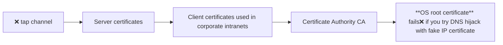

## Session Cookie 
A session stores state across multiple requests:
- Logged-in status
- Preferences
- Permissions (allow this site every time)
- Cookies

Server sends:
```
Set-Cookie: <cookie-name> =<cookie-value>; Domain=<domain-value>; Secure; HttpOnly
```

- delete cookie record to logout
- client must send cookies back with every subsequent request

## Types of Session Storage
1. **Client-Side Session**: Entire data stored in cookie but can be modified by user
- Not sensitive(font, light/dark mode) can be on <span style="font-weight:bold; color:rgb(181, 118, 244)"> client side </span>  (can modify/access)
2.  **Server-Side Session**: Cookie stores only session ID. Actual data stored on server
  - ✅Sensitive(user permissions, session tokens) stored on the <span style="font-weight:bold; color:rgb(181, 118, 244)"> server side </span> and referenced using an identifier (stored in a cookie) 
  - Backend options:
    - Database
    - File storage
    - `redis cache key-value stores`
  
## Cookie Theft
If stolen → attacker can impersonate user. We can avoid this by:
- Session timeout
- IP validation
- If someone steals the cookie, can't impersonate the user.

Cross-Site Request Forgery (CSRF)
Attacker tricks user into sending unintended requests

:::info

1. User logs into bank
2. Attacker sends malicious link or create page
3. Browser auto-submits request using existing session cookie (unauthorized requests to another logged-in site)

→ Money transfer happens without user intent

Solution: Validate request origin (CSRF tokens)*verify on server that legitimate start point*
:::

```python
from flask_login import login_required, current_user, logout_user, login_user

app.secret_key ='_5#y2L"F4Q8z/n/xec]/'

@app.route('/')
def index () :
	if 'username' in session:
		return f'Logged in as {session ["username"] } '
	return 'You are not logged in'

@app.route('/login' , methods=['GET', 'POST' ] )
	def login():
	if request.method == 'POST':
		session['username' ] = request.form ['username' ] # Store username
		return redirect (url for ('index' ) )
	return '''<form method="post">
	<p><input type=text name=username>
	<p><input type=submit value=Login>
	</form>'''

@app.route('/profile')
@login_required
def profile() :
	return f'Welcome back {current_user.name}'

@app.route("/logout")
@login_required
def logout():
	logout_user()
	return redirect(url_for('main.index'))
```

## HTTPS
- Problem with HTTP: open connection to server on fixed network port `default 80` and data is visible + modifiable
Encrypts all **physical wire** communications using **TLS/SSL** protocols

:::HTTPS **secure sockets** encrypted channel
Data encrypted using a shared secret key  `long binary string KEY`
Without key → unreadable (`XOR` all input data with key to generate new binary encrypt text)
### TLS Handshake
1. Client connects
2. Server sends certificate
3. Client verifies certificate
4. Secure key established
5. Encrypted communication begins

### Server Authentication
Prevents: DNS hijacking (false IP address) or fake servers

- Uses chain of trust:
    - **Server certificate**
    - **Certificate Authority (CA)**
    - **Root certificate** (stored in OS/browser)



| Advantages | Limitations |
|-----|----|
| Confidentiality of user identity in public WiFi Networks | Performance over head to `encrypt` |
| integrity (hard for hacker to tamper between channels) | proxy caching becomes difficult |
| Authentication (server verified) | old browsers may lack updated certificate chains |

- **Client or OS root** could be stolen certificates → revocate → ensure OS, browser update **trust stores**


Wildcard Certificates
1 certificate that secures all subdomains of a domain
Example (not actual google certificate implementation): `*.google.com` covers all subdomains like `docs.google`, `maps.google. and `mail.google`
- If compromised → all subdomains affected


## Logging
Logging is the process of recording events, activities, and accesses within an application or system.

- Stores information like requests, errors, user actions
- Helps track system behavior over time

### Why is Logging Important?
- **Debugging**: identify bugs and errors quickly
- **Usage Analytics**: understand user behavior and traffic patterns
- **Performance Optimization**: detect bottlenecks and improve efficiency
- **Security Monitoring**: identify suspicious or malicious activities

### Server-level Logging

Built into web servers like `Apache HTTP Server & Nginx` to log:
- URLs accessed: look for malformed or suspicious URLs
- Requests per second: look for sudden spike in requests or repeated failed requests
- IP addresses: repeated access to restricted endpoints
- Status codes

### Application-level Logging
Python logging framework logs include:
- Controller & database interactions
- Errors and exceptions
- Security-related events

### Log Rotation
Logs grow very large → storage issues:
1. keep last $N$ files
2. delete oldest file(less space overhead)
3. rename $\log.i \to \log.i+1$

### Logging in Cloud Platforms
- Automatic log collection
- Usage analytics
- `Google App Engine` gives performance-usage reports, automated security analyses on `log`

### Time-Series Analysis
Logs include timestamps, so we can analyze:
1. **Event Density**
- Events per second (requests/sec)
2. **Pattern Detection**
- Periodic spikes
- Sudden traffic surges
3. **Incident Analysis**
- Identify exact time of failure or attack
- Time-series Database: `RRDTool, InfluxDV, Prometheus` query trends and metrics
